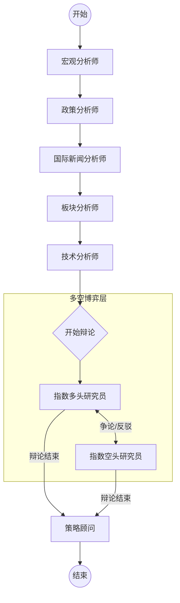

# 指数分析多空博弈概要设计

## 1. 总体架构图

## 2. 模块设计

### 2.1 新增 Agent：指数多头研究员 (Index Bull Researcher)
- **文件**：`tradingagents/agents/researchers/index_bull_researcher.py`
- **职责**：
    - 针对**目标指数**（`company_of_interest`），读取 Macro, Policy, Sector, News, Technical 的 Markdown 报告。
    - 提取支持该指数上涨的论据（如：成分股业绩回暖、行业政策利好、指数技术面金叉等）。
    - 生成“加仓”建议的强力辩词。
- **输入**：`AgentState` (包含目标指数代码 + 所有上游报告 + 辩论历史 `history`)
- **输出**：更新 `investment_debate_state`

### 2.2 新增 Agent：指数空头研究员 (Index Bear Researcher)
- **文件**：`tradingagents/agents/researchers/index_bear_researcher.py`
- **职责**：
    - 针对**目标指数**，读取同上报告。
    - 提取支持该指数下跌/避险的论据（如：行业周期下行、估值泡沫、成分股减持、技术面破位等）。
    - 生成“减仓/空仓”建议的强力辩词。
- **输入**：同上
- **输出**：同上

### 2.3 升级 Agent：策略顾问 (Strategy Advisor)
- **文件**：`tradingagents/agents/analysts/strategy_advisor.py`
- **变更点**：
    - **Prompt 增强**：增加对 `debate_history` 的读取指令。要求提取 `debate_summary`。
    - **逻辑增强**：在生成 `rationale` 时，必须引用辩论中的观点作为佐证。
    - **输出结构**：JSON schema 中新增 `debate_summary` 字段。

### 2.4 工作流编排 (Graph Setup)
- **文件**：`tradingagents/graph/setup.py`
- **变更点**：
    - 在 `_setup_index_graph` 方法中注册 Bull/Bear 节点。
    - 插入 Conditional Edges，复用 `should_continue_debate` 逻辑控制辩论轮次（默认1-2轮）。
    - 调整连线：`Technical Analyst` -> `Index Bull Researcher` -> ... -> `Strategy Advisor`。

## 3. 数据流设计

1.  **上游**：各分析师将 Markdown 报告写入 `AgentState` 的对应字段（如 `macro_report`）。
2.  **中游**：
    - Bull/Bear 读取报告。
    - 产生辩论内容追加到 `AgentState["investment_debate_state"]["history"]`。
3.  **下游**：
    - Strategy Advisor 读取 `history`。
    - 综合 Report + Debate History 生成最终 JSON。

## 4. 关键交互逻辑

- **轮次控制**：使用 `ConditionalLogic.should_continue_debate`。
- **状态保持**：`investment_debate_state` 字典用于在 Bull/Bear 之间传递上下文。
