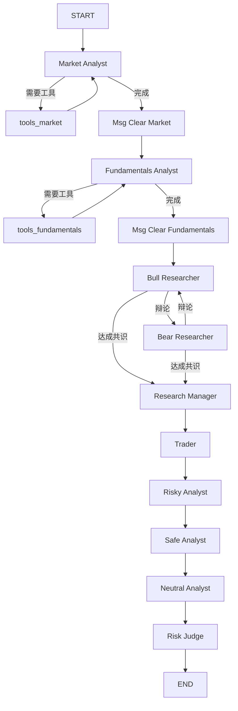

# LangGraph 使用情况与 MCP 支持分析

## 📊 项目中 LangGraph 的使用情况

### ✅ 是的，项目大量使用 LangGraph！

LangGraph 是本项目的**核心架构组件**，用于构建多智能体协作工作流。

---

## 🏗️ LangGraph 架构概览

### 1. **核心文件结构**

```
tradingagents/graph/
├── trading_graph.py          # 主图执行引擎（1398 行）
├── setup.py                   # 图结构设置（254 行）
├── conditional_logic.py       # 条件路由逻辑
├── propagation.py             # 状态传播
├── reflection.py              # 反思机制
└── signal_processing.py       # 信号处理
```

### 2. **LangGraph 导入与使用**

<augment_code_snippet path="tradingagents/graph/setup.py" mode="EXCERPT">
````python
from langgraph.graph import END, StateGraph, START
from langgraph.prebuilt import ToolNode
````
</augment_code_snippet>

<augment_code_snippet path="tradingagents/graph/trading_graph.py" mode="EXCERPT">
````python
from langgraph.prebuilt import ToolNode
````
</augment_code_snippet>

### 3. **多智能体工作流图**

项目使用 `StateGraph` 构建了一个复杂的多智能体协作图：

#### 节点类型：

1. **分析师节点**（Analyst Nodes）
   - Market Analyst（市场分析师）
   - Fundamentals Analyst（基本面分析师）
   - News Analyst（新闻分析师）
   - Social Analyst（社交媒体分析师）

2. **工具节点**（Tool Nodes）
   - `tools_market` - 市场数据工具
   - `tools_fundamentals` - 基本面数据工具
   - `tools_news` - 新闻数据工具
   - `tools_social` - 社交媒体数据工具

3. **研究员节点**（Researcher Nodes）
   - Bull Researcher（多头研究员）
   - Bear Researcher（空头研究员）
   - Research Manager（研究经理）

4. **风险分析节点**（Risk Analysis Nodes）
   - Risky Analyst（激进分析师）
   - Neutral Analyst（中性分析师）
   - Safe Analyst（保守分析师）
   - Risk Judge（风险评估师）

5. **交易员节点**（Trader Node）
   - Trader（交易员）

6. **消息清理节点**（Message Clear Nodes）
   - 每个分析师都有对应的消息清理节点

#### 工作流程：



### 4. **关键代码示例**

<augment_code_snippet path="tradingagents/graph/setup.py" mode="EXCERPT">
````python
# Create workflow
workflow = StateGraph(AgentState)

# Add analyst nodes to the graph
for analyst_type, node in analyst_nodes.items():
    workflow.add_node(f"{analyst_type.capitalize()} Analyst", node)
    workflow.add_node(f"Msg Clear {analyst_type.capitalize()}", delete_nodes[analyst_type])
    workflow.add_node(f"tools_{analyst_type}", tool_nodes[analyst_type])

# Add conditional edges for current analyst
workflow.add_conditional_edges(
    current_analyst,
    getattr(self.conditional_logic, f"should_continue_{analyst_type}"),
    [current_tools, current_clear],
)
````
</augment_code_snippet>

### 5. **状态管理**

项目使用自定义的状态类：
- `AgentState` - 主要智能体状态
- `InvestDebateState` - 投资辩论状态
- `RiskDebateState` - 风险辩论状态

---

## 🔌 LangGraph 对 MCP 的支持

### ✅ LangGraph 完全支持 MCP（Model Context Protocol）

### 1. **什么是 MCP？**

**Model Context Protocol (MCP)** 是 Anthropic 推出的一个开放协议，用于：
- 标准化 AI 应用与外部工具/数据源的集成
- 提供统一的工具调用接口
- 支持多种工具类型（文件系统、数据库、API 等）

### 2. **LangGraph + MCP 集成方式**

#### 官方支持库：`langchain-mcp-adapters`

```bash
pip install langchain-mcp-adapters
```

#### 基本使用示例：

```python
from langchain_mcp_adapters import MCPClient
from langgraph.prebuilt import create_react_agent
from langchain_openai import ChatOpenAI

# 1. 连接到 MCP 服务器
async with MCPClient() as client:
    # 连接到 MCP 服务器
    await client.connect_to_server(
        "filesystem",
        command="npx",
        args=["-y", "@modelcontextprotocol/server-filesystem", "/path/to/data"]
    )
    
    # 2. 加载 MCP 工具
    tools = await client.list_tools()
    
    # 3. 创建 LangGraph Agent
    llm = ChatOpenAI(model="gpt-4")
    agent = create_react_agent(llm, tools)
    
    # 4. 运行 Agent
    result = await agent.ainvoke({
        "messages": [("user", "读取文件内容")]
    })
```

### 3. **MCP 的优势**

| 特性 | 传统方式 | MCP 方式 |
|------|---------|---------|
| **工具集成** | 每个工具需要单独实现 | 统一的 MCP 协议 |
| **工具发现** | 手动配置 | 自动发现和加载 |
| **工具调用** | 自定义格式 | 标准化格式 |
| **错误处理** | 各自实现 | 统一的错误处理 |
| **安全性** | 需要自己实现 | 内置权限控制 |

### 4. **MCP 支持的工具类型**

- 📁 **文件系统**：`@modelcontextprotocol/server-filesystem`
- 🗄️ **数据库**：`@modelcontextprotocol/server-postgres`, `@modelcontextprotocol/server-sqlite`
- 🌐 **Web API**：`@modelcontextprotocol/server-fetch`
- 🔍 **搜索引擎**：`@modelcontextprotocol/server-brave-search`
- 📊 **Google Sheets**：`@modelcontextprotocol/server-google-sheets`
- 💬 **Slack**：`@modelcontextprotocol/server-slack`
- 🐙 **GitHub**：`@modelcontextprotocol/server-github`
- 📧 **Gmail**：`@modelcontextprotocol/server-gmail`

---

## 🚀 如何在本项目中集成 MCP

### 方案 1：替换现有工具为 MCP 工具

#### 当前实现：
```python
# tradingagents/agents/utils/agent_utils.py
from langchain_core.tools import tool

@tool
def get_stock_market_data_unified(ticker: str, curr_date: str) -> str:
    """获取股票市场数据"""
    # 自定义实现
    pass
```

#### MCP 实现：
```python
from langchain_mcp_adapters import MCPClient

async def setup_mcp_tools():
    """设置 MCP 工具"""
    client = MCPClient()
    
    # 连接到自定义的股票数据 MCP 服务器
    await client.connect_to_server(
        "stock_data",
        command="python",
        args=["mcp_servers/stock_data_server.py"]
    )
    
    # 加载工具
    tools = await client.list_tools()
    return tools
```

### 方案 2：混合使用（推荐）

保留现有工具，同时支持 MCP 工具：

```python
# tradingagents/graph/trading_graph.py

from langchain_mcp_adapters import MCPClient

class TradingAgentsGraph:
    def __init__(self, use_mcp=False, mcp_servers=None):
        self.use_mcp = use_mcp
        self.mcp_servers = mcp_servers or []
        
        # 加载传统工具
        self.traditional_tools = self._load_traditional_tools()
        
        # 如果启用 MCP，加载 MCP 工具
        if self.use_mcp:
            self.mcp_tools = await self._load_mcp_tools()
            self.all_tools = self.traditional_tools + self.mcp_tools
        else:
            self.all_tools = self.traditional_tools
    
    async def _load_mcp_tools(self):
        """加载 MCP 工具"""
        tools = []
        async with MCPClient() as client:
            for server_config in self.mcp_servers:
                await client.connect_to_server(**server_config)
                server_tools = await client.list_tools()
                tools.extend(server_tools)
        return tools
```

### 方案 3：创建自定义 MCP 服务器

为项目的数据源创建 MCP 服务器：

```python
# mcp_servers/tradingagents_mcp_server.py

from mcp.server import Server
from mcp.types import Tool, TextContent

app = Server("tradingagents-data")

@app.list_tools()
async def list_tools() -> list[Tool]:
    return [
        Tool(
            name="get_stock_data",
            description="获取股票市场数据",
            inputSchema={
                "type": "object",
                "properties": {
                    "ticker": {"type": "string"},
                    "date": {"type": "string"}
                }
            }
        ),
        Tool(
            name="get_fundamentals",
            description="获取基本面数据",
            inputSchema={
                "type": "object",
                "properties": {
                    "ticker": {"type": "string"}
                }
            }
        )
    ]

@app.call_tool()
async def call_tool(name: str, arguments: dict) -> list[TextContent]:
    if name == "get_stock_data":
        # 调用现有的数据获取逻辑
        from tradingagents.dataflows import get_market_data
        result = get_market_data(arguments["ticker"], arguments["date"])
        return [TextContent(type="text", text=result)]
    # ... 其他工具
```

---

## 📊 MCP 集成的收益评估

### 技术收益

1. **标准化工具接口** ✅
   - 统一的工具调用格式
   - 更好的类型安全
   - 自动化的工具发现

2. **更好的可扩展性** ✅
   - 轻松添加新的数据源
   - 支持第三方 MCP 服务器
   - 社区生态丰富

3. **改进的错误处理** ✅
   - 统一的错误格式
   - 更好的调试体验
   - 内置重试机制

4. **安全性提升** ✅
   - 权限控制
   - 沙箱执行
   - 审计日志

### 业务收益

1. **开发效率提升** 📈
   - 减少自定义工具开发时间
   - 复用社区 MCP 服务器
   - 更快的功能迭代

2. **维护成本降低** 💰
   - 统一的工具管理
   - 减少重复代码
   - 更容易的版本升级

3. **功能扩展性** 🚀
   - 轻松集成新的数据源（如 Bloomberg、Reuters）
   - 支持更多分析工具
   - 可以连接企业内部系统

---

## ⚠️ MCP 集成的挑战

### 1. **异步编程复杂度**
- MCP 客户端是异步的（`async/await`）
- 需要重构部分同步代码
- 可能影响现有的同步工作流

**缓解措施**：
```python
# 使用 asyncio.run() 包装异步调用
import asyncio

def sync_wrapper():
    return asyncio.run(async_function())
```

### 2. **依赖 Node.js**
- 大多数 MCP 服务器是 Node.js 实现
- 需要安装 Node.js 和 npm
- 增加部署复杂度

**缓解措施**：
- 使用 Docker 容器化 MCP 服务器
- 或者用 Python 重新实现 MCP 服务器

### 3. **性能开销**
- MCP 通过进程间通信（IPC）
- 可能比直接调用慢
- 需要额外的序列化/反序列化

**缓解措施**：
- 对性能敏感的工具保留直接调用
- 使用缓存减少 MCP 调用次数
- 批量处理请求

### 4. **学习曲线**
- 团队需要学习 MCP 协议
- 需要理解异步编程
- 调试更复杂

**缓解措施**：
- 提供详细的文档和示例
- 逐步迁移，先从非关键工具开始
- 保留传统工具作为备选

---

## 🎯 MCP 集成建议

### 短期建议（1-3 个月）

#### ❌ 不建议立即全面集成 MCP

**原因**：
1. 当前工具系统运行稳定
2. MCP 生态还在快速发展中
3. 需要大量重构工作
4. 团队需要学习新技术

#### ✅ 建议进行试点测试

**试点范围**：
- 选择 1-2 个非关键工具进行 MCP 改造
- 例如：新闻数据获取、社交媒体分析
- 在测试环境验证可行性

**试点步骤**：
1. 安装 `langchain-mcp-adapters`
2. 选择一个简单的 MCP 服务器（如文件系统）
3. 创建一个简单的 LangGraph Agent 测试
4. 评估性能和稳定性

### 中期建议（3-6 个月）

#### ✅ 逐步扩大 MCP 使用范围

**优先级**：
1. **高优先级**：外部数据源（新闻、社交媒体）
   - 这些数据源变化频繁
   - MCP 可以提供更好的抽象
   - 社区可能有现成的 MCP 服务器

2. **中优先级**：新增功能
   - 新功能直接使用 MCP 实现
   - 避免增加技术债务
   - 积累 MCP 使用经验

3. **低优先级**：核心数据源（市场数据、基本面数据）
   - 这些工具已经很稳定
   - 性能要求高
   - 暂时保留直接调用

### 长期建议（6-12 个月）

#### ✅ 建立混合架构

**架构设计**：
```
┌─────────────────────────────────────┐
│      LangGraph Agent System         │
├─────────────────────────────────────┤
│                                     │
│  ┌──────────────┐  ┌─────────────┐ │
│  │ Traditional  │  │ MCP Tools   │ │
│  │ Tools        │  │             │ │
│  │              │  │             │ │
│  │ • 市场数据   │  │ • 新闻API   │ │
│  │ • 基本面数据 │  │ • 社交媒体  │ │
│  │ • 技术指标   │  │ • 第三方数据│ │
│  └──────────────┘  └─────────────┘ │
│                                     │
│  ┌─────────────────────────────┐   │
│  │   Unified Tool Interface    │   │
│  └─────────────────────────────┘   │
└─────────────────────────────────────┘
```

**优势**：
- 保留现有稳定工具
- 新功能使用 MCP
- 灵活切换
- 降低风险

---

## 📚 参考资源

### 官方文档
- [LangChain MCP Documentation](https://docs.langchain.com/oss/python/langchain/mcp)
- [langchain-mcp-adapters GitHub](https://github.com/langchain-ai/langchain-mcp-adapters)
- [Model Context Protocol Specification](https://modelcontextprotocol.io/)
- [Anthropic MCP Documentation](https://docs.anthropic.com/en/docs/build-with-claude/mcp)

### 示例项目
- [teddynote-lab/langgraph-mcp-agents](https://github.com/teddynote-lab/langgraph-mcp-agents) - LangGraph + MCP 示例
- [LangGraph MCP Integration Tutorial](https://latenode.com/blog/ai-frameworks-technical-infrastructure/langgraph-multi-agent-orchestration/langgraph-mcp-integration-complete-model-context-protocol-setup-guide-working-examples-2025)

### MCP 服务器列表
- [Awesome MCP Servers](https://github.com/modelcontextprotocol/servers) - 官方 MCP 服务器列表
- [Community MCP Servers](https://github.com/topics/mcp-server) - 社区 MCP 服务器

### 相关文章
- [Building Agentic Flows with LangGraph & MCP](https://www.qodo.ai/blog/building-agentic-flows-with-langgraph-model-context-protocol/)
- [Using LangChain With Model Context Protocol](https://cobusgreyling.medium.com/using-langchain-with-model-context-protocol-mcp-e89b87ee3c4c)

---

## 📝 总结

### LangGraph 使用情况

✅ **项目大量使用 LangGraph**
- 核心架构组件
- 构建复杂的多智能体协作工作流
- 包含 10+ 个智能体节点
- 支持条件路由和状态管理
- 代码成熟稳定（1398 行主文件）

### MCP 支持情况

✅ **LangGraph 完全支持 MCP**
- 官方提供 `langchain-mcp-adapters` 库
- 可以无缝集成 MCP 工具
- 支持多种 MCP 服务器
- 社区生态活跃

### 集成建议

#### 短期（1-3 个月）
- ⏳ 不建议立即全面集成
- ✅ 建议进行试点测试
- ✅ 选择 1-2 个非关键工具试点

#### 中期（3-6 个月）
- ✅ 逐步扩大 MCP 使用范围
- ✅ 优先改造外部数据源
- ✅ 新功能直接使用 MCP

#### 长期（6-12 个月）
- ✅ 建立混合架构
- ✅ 核心工具保留直接调用
- ✅ 新功能和外部数据源使用 MCP

### 关键优势

1. **标准化**：统一的工具接口
2. **可扩展性**：轻松添加新数据源
3. **社区生态**：丰富的 MCP 服务器
4. **安全性**：内置权限控制

### 主要挑战

1. **异步编程**：需要重构部分代码
2. **依赖 Node.js**：增加部署复杂度
3. **性能开销**：进程间通信开销
4. **学习曲线**：团队需要学习新技术

### 最终建议

**采用渐进式集成策略**：
- 保留现有稳定工具
- 新功能优先使用 MCP
- 逐步积累经验
- 降低迁移风险

