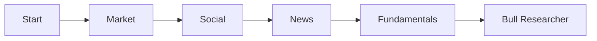
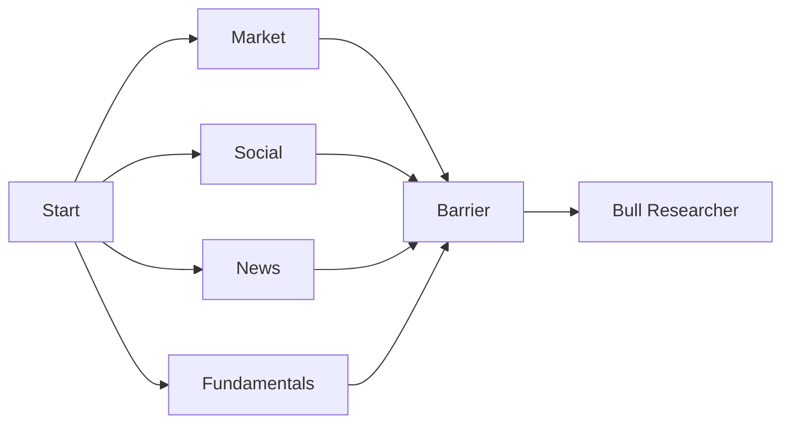

# 个股分析并行化改造说明

## 1. 背景与目标

在完成了指数分析（Index Analysis）的并行化改造后，我们发现个股分析（Stock Analysis）流程仍然沿用旧的串行模式。
原有的串行流程如下：
`START -> Market -> Social -> News -> Fundamentals -> Bull Researcher ...`

这种模式存在以下问题：
1.  **耗时叠加**：总耗时等于各个分析模块耗时之和。例如，如果每个模块耗时 30秒，4个模块就需要 2分钟。
2.  **资源利用率低**：各个模块之间（如市场技术分析与基本面分析）并无强依赖关系，串行执行浪费了系统并发能力。

本改造的目标是将个股分析的基础模块改为**并行执行**，预期将基础分析阶段的耗时缩短为**最慢模块的耗时**（约提升 2-3 倍效率）。

## 2. 改造方案

复用指数分析的 "Fan-out / Fan-in" (扇出/扇入) 模式，重构 `tradingagents/graph/setup.py` 中的 `_setup_stock_graph` 方法。

### 2.1 拓扑结构变更

**Before (Serial):**

**After (Parallel):**

### 2.2 核心逻辑实现

1.  **并行启动**：`START` 节点直接连接到所有被选中的分析师节点（Market, Social, News, Fundamentals）。
2.  **同步屏障 (Barrier)**：新增 `Stock Analysis Barrier` 节点。
    *   所有分析师节点执行完后，连接到此屏障。
    *   屏障节点通过 `_should_continue_stock_barrier` 方法检查 State 中是否已包含所有选中模块的报告（`market_report`, `sentiment_report`, `news_report`, `fundamentals_report`）。
    *   只有当所有报告就绪后，才放行至 `Bull Researcher`。

## 3. 代码变更点

修改文件：`tradingagents/graph/setup.py`

1.  **新增 `_stock_barrier_node`**: 空操作节点，作为汇聚点。
2.  **新增 `_should_continue_stock_barrier`**: 检查逻辑，判断并行任务是否全部完成。
3.  **重构 `_setup_stock_graph`**:
    *   移除节点间的串行连线。
    *   将 `START` 连向所有 Analyst。
    *   将所有 Analyst 的结束点连向 Barrier。
    *   将 Barrier 连向 `Bull Researcher`。

## 4. 预期效果

*   **速度提升**：个股分析的基础分析阶段（技术、社媒、新闻、基本面）将同时进行。理论上，该阶段耗时将取决于最慢的那个 Agent（通常是基本面或新闻搜索）。
*   **体验优化**：用户等待时间大幅减少。
*   **兼容性**：完全兼容现有的前端请求参数，无需修改 API 接口。

## 5. 验证方法

提交一个包含所有分析师的个股分析任务，观察日志：
1.  应看到所有分析师几乎同时打印 `[开始执行]` 日志。
2.  应看到 `[Barrier] 等待模块完成` 的日志出现，直到所有模块完成后打印 `[Barrier] 所有个股分析模块已完成`。
