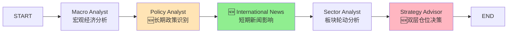
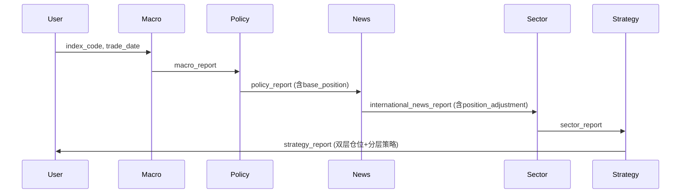

# 指数分析Workflow优化概要设计

**文档版本**: v1.0  
**创建日期**: 2024-12-14  
**作者**: 技术团队  
**状态**: 设计中

---

## 📋 目录

1. [设计目标](#1-设计目标)
2. [总体架构](#2-总体架构)
3. [核心设计理念](#3-核心设计理念)
4. [模块设计](#4-模块设计)
5. [工作流设计](#5-工作流设计)
6. [数据流设计](#6-数据流设计)
7. [接口设计](#7-接口设计)
8. [技术选型](#8-技术选型)
9. [性能评估](#9-性能评估)
10. [风险分析](#10-风险分析)

---

## 1. 设计目标

### 1.1 核心目标

**区分长期政策支持与短期新闻影响,由Strategy Advisor整合全部信息给出科学的持仓调整建议**

**设计原则**: 信息分析与决策制定职责分离
- 各分析Agent只负责**信息采集和分析**
- Strategy Advisor统一负责**决策和仓位建议**

### 1.2 具体目标

| 目标维度 | 当前状态 (v2.0.0) | 目标状态 (v2.1.0) | 量化指标 |
|---------|------------------|------------------|---------|
| **职责分离** | 部分Agent混杂决策逻辑 | 分析与决策完全分离 | 架构清晰度+100% |
| **信息时效性** | 国内新闻源,滞后1-2天 | 国际新闻源,领先1-2天 | 时效性提升2-4天 |
| **决策科学性** | 单一仓位值 | 双层仓位+分层策略 | 决策维度增加3倍 |
| **风险控制** | 简单风险描述 | 多维度量化评估 | 风险维度增加4倍 |
| **用户价值** | 基础分析 | 机构级分析 | 专业投资者满意度+50% |

### 1.3 非功能性目标

- **向后兼容**: 100%兼容v2.0.0,不影响现有功能
- **性能约束**: 执行时间增加<50% (2-3分钟→3-4分钟)
- **成本控制**: 运营成本<$110/月 (可降至$10/月)
- **可维护性**: 代码清晰,文档完善,易于扩展

---

## 2. 总体架构

### 2.1 系统架构图

```
┌─────────────────────────────────────────────────────────────┐
│                     TradingAgents-CN v2.1.0                 │
│                   指数分析Workflow优化版                     │
└─────────────────────────────────────────────────────────────┘
                              ↓
        ┌─────────────────────┴─────────────────────┐
        │                                           │
   ┌────▼────┐                                 ┌────▼────┐
   │个股分析  │                                 │指数分析  │
   │workflow │                                 │workflow │
   │ v2.0.0  │                                 │ v2.1.0  │ ← 本次优化
   └────┬────┘                                 └────┬────┘
        │                                           │
        │  ┌────────────────────────────────────────┤
        │  │                                        │
        ▼  ▼                                        ▼
   ┌─────────────┐                         ┌──────────────┐
   │ Agent层     │                         │ 🆕 扩展Agent │
   │ (8个Agent)  │                         │ +1个新Agent  │
   └──────┬──────┘                         └──────┬───────┘
          │                                       │
          ▼                                       ▼
   ┌─────────────────────────────────────────────────────┐
   │              Tool层 (工具集)                         │
   │  - 市场数据  - 财报数据  - 新闻数据                   │
   │  - 🆕 国际新闻 (NewsAPI/Google News)                 │
   └──────────────────────┬──────────────────────────────┘
                          │
                          ▼
   ┌─────────────────────────────────────────────────────┐
   │              Data层 (数据提供者)                     │
   │  - AKShare  - Tushare  - yfinance                   │
   │  - 🆕 NewsAPI  - 🆕 Google News                      │
   └──────────────────────┬──────────────────────────────┘
                          │
                          ▼
   ┌─────────────────────────────────────────────────────┐
   │              Storage层 (存储)                        │
   │  - MongoDB  - Redis  - Local Files                  │
   └─────────────────────────────────────────────────────┘
```

### 2.2 模块依赖关系

```
┌──────────────────────────────────────────────────────────┐
│                    v2.1.0 新增/修改模块                   │
└──────────────────────────────────────────────────────────┘

┌─────────────────┐
│ 1. Data层       │
│ ─────────────── │
│ 🆕 NewsAPI接口  │ ← 新增
│ 🆕 Google News  │ ← 新增
└────────┬────────┘
         │ provides data to
         ▼
┌─────────────────────────────────┐
│ 2. Tool层                        │
│ ────────────────────────────     │
│ 🆕 fetch_bloomberg_news          │ ← 新增
│ 🆕 fetch_reuters_news            │ ← 新增
│ 🆕 fetch_google_news             │ ← 新增
└────────┬────────────────────────┘
         │ used by
         ▼
┌────────────────────────────────────────────┐
│ 3. Agent层                                  │
│ ─────────────────────────────────          │
│ 🆕 International News Analyst (新增)        │
│ 📝 Policy Analyst (扩展)                    │
│ 📝 Strategy Advisor (重构)                  │
│ ✅ Macro Analyst (不变)                     │
│ ✅ Sector Analyst (不变)                    │
└────────┬───────────────────────────────────┘
         │ executes in
         ▼
┌────────────────────────────────────────────┐
│ 4. Workflow层                               │
│ ─────────────────────────────────          │
│ 📝 setup_index_graph (修改)                 │
│   - 新增International News节点              │
│   - 调整节点顺序                            │
└────────┬───────────────────────────────────┘
         │ uses
         ▼
┌────────────────────────────────────────────┐
│ 5. State层                                  │
│ ─────────────────────────────────          │
│ 📝 AgentState (扩展)                        │
│   - 🆕 international_news_report            │
│   - 🆕 international_news_tool_call_count   │
└────────────────────────────────────────────┘

图例:
🆕 新增模块/功能
📝 修改现有模块
✅ 保持不变
```

---

## 3. 核心设计理念

### 3.1 职责分离原则

这是本次优化的**核心设计理念**。

#### 设计原理

```
信息流 vs 决策流 完全分离

┌─────────────────────────────────────────────┐
│           信息采集与分析层                    │
│         (只负责信息,不做决策)                 │
└─────────────────────────────────────────────┘

Macro Analyst
  ↓ 输出: 宏观经济环境分析
  - GDP增速、通胀水平、流动性状况
  - ❌ 不输出仓位建议
  - ✅ 只输出宏观情绪评分

Policy Analyst
  ↓ 输出: 政策支持力度分析
  - 长期战略政策识别
  - 政策连续性评估
  - ❌ 不输出基础仓位
  - ✅ 只输出政策支持强度(强/中/弱)

International News Analyst
  ↓ 输出: 短期新闻事件分析
  - 新闻分类(政策传闻/行业事件/市场情绪)
  - 影响持续期评估(短期/中期/长期)
  - 可信度评分(0-1)
  - ❌ 不输出仓位调整建议
  - ✅ 只输出影响强度(高/中/低)

Sector Analyst
  ↓ 输出: 板块轮动分析
  - 板块资金流向
  - 受益板块识别
  - ❌ 不输出配置建议
  - ✅ 只输出板块热度评分

┌─────────────────────────────────────────────┐
│              决策制定层                       │
│      (整合全部信息,统一决策)                  │
└─────────────────────────────────────────────┘

Strategy Advisor (唯一决策节点)
  ↓ 整合上游所有信息
  1. 读取Macro环境评分
  2. 读取Policy支持强度
  3. 读取International News影响强度
  4. 读取Sector热度评分
  ↓ 综合决策算法
  - 基础仓位 = f(政策支持强度, 宏观环境)
  - 短期调整 = f(新闻影响强度, 影响持续期, 可信度)
  - 最终仓位 = 基础仓位 + 短期调整
  ↓ 输出完整决策
  - ✅ 最终仓位建议
  - ✅ 分层持仓策略
  - ✅ 动态调整触发条件
```

#### 设计优势

| 传统混合职责 | 职责分离设计 |
|------------|------------|
| Agent既分析又决策,逻辑混乱 | 分析Agent只输出信息,Strategy统一决策 |
| 难以追溯决策依据 | 每个环节清晰可追溯 |
| 修改困难,牵一发动全身 | 修改决策逻辑只需调整Strategy Advisor |
| 测试复杂 | 分析层和决策层可独立测试 |

#### 真实案例

**场景**: 分析中证半导体指数

```
📊 信息采集层 (各Agent独立分析)
────────────────────────────────────────
Policy Analyst:
  {
    "key_policies": [
      {
        "name": "自主可控",
        "type": "长期战略政策",
        "duration": "5-10年",
        "continuity_score": 0.9,
        "support_strength": "强"  ← 只给强度,不给仓位
      }
    ],
    "overall_support": "强"
  }

International News Analyst:
  {
    "key_news": [
      {
        "source": "Bloomberg",
        "title": "中国计划千亿芯片支持",
        "type": "政策传闻",
        "impact_duration": "中期(1-4周)",
        "credibility": 0.8,
        "impact_strength": "高"  ← 只给影响强度,不给调整值
      }
    ]
  }

Macro Analyst:
  {
    "economic_cycle": "复苏期",
    "liquidity": "宽松",
    "macro_sentiment_score": 0.7  ← 只给评分
  }

Sector Analyst:
  {
    "hot_sectors": ["芯片", "半导体设备"],
    "sector_heat_score": 0.85  ← 只给热度
  }

🎯 决策制定层 (Strategy Advisor统一决策)
────────────────────────────────────────
Strategy Advisor:
  # 步骤1: 读取所有上游信息
  policy_strength = "强"  # 从Policy Analyst
  news_impact = "高"      # 从International News
  macro_score = 0.7       # 从Macro Analyst
  sector_heat = 0.85      # 从Sector Analyst
  
  # 步骤2: 决策算法
  ## 基础仓位决策
  if policy_strength == "强" and macro_score > 0.6:
      base_position = 0.60
  elif policy_strength == "中" and macro_score > 0.5:
      base_position = 0.50
  else:
      base_position = 0.40
  
  ## 短期调整决策
  if news_impact == "高" and credibility > 0.7:
      short_term_adjustment = 0.15
  elif news_impact == "中":
      short_term_adjustment = 0.10
  else:
      short_term_adjustment = 0.05
  
  # 步骤3: 综合决策
  final_position = base_position + short_term_adjustment  # 0.75
  
  # 步骤4: 输出完整决策
  {
    "final_position": 0.75,
    "position_breakdown": {
      "core_holding": 0.40,    # 核心长期
      "tactical_allocation": 0.35,  # 战术配置
      "cash_reserve": 0.25     # 现金储备
    },
    "adjustment_triggers": {
      "increase_to": 0.90,
      "increase_condition": "政策正式官宣",
      "decrease_to": 0.40,
      "decrease_condition": "传闻证伪"
    },
    "decision_rationale": "基于强政策支持(60%)+高影响新闻(+15%)=75%"
  }
```

### 3.2 双层仓位决策机制

这是本次优化的**第二个核心设计理念**。

#### 设计原理

```
投资决策 = 长期趋势 + 短期波动

长期趋势 (Strategic Position)
  ↓
基于长期政策支持 (5-10年)
  - 自主可控
  - 新质生产力
  - 碳中和
  ↓
基础仓位: 60%
  ↓
  适合: 中长期配置,不轻易变动


短期波动 (Tactical Adjustment)
  ↓
基于短期新闻影响 (1-4周)
  - 彭博社政策传闻
  - 突发行业事件
  - 外资流向变化
  ↓
短期调整: +15%
  ↓
  适合: 战术性加仓,灵活调整


综合决策 (Final Position)
  ↓
基础仓位 + 短期调整
  ↓
最终仓位: 75%
  ↓
分层持仓:
  - 核心长期: 40% (不动)
  - 战术配置: 35% (可调)
  - 现金储备: 25% (待机)
```

#### 设计优势

| 传统单一仓位 | 双层仓位决策 |
|------------|------------|
| 仅给出一个值: 70% | Strategy Advisor整合: 60%(基础) + 15%(短期) = 75% |
| 用户不知道何时调整 | 明确调整触发条件 |
| 容易过度交易 | 区分长期/短期,避免混淆 |
| 缺少持仓结构 | 提供三层持仓策略 |

#### 真实案例

**场景**: 分析中证半导体指数

```
📊 信息层 (各Agent输出)
─────────────────────────────────

Policy Analyst (长期):
- 识别: "自主可控"战略 (5-10年)
- 评估: 政策连续性0.9,支持强度"强"
- 输出: 支持强度="强"  ← 只给强度,不给仓位

International News Analyst (短期):
- 捕捉: 彭博社"千亿芯片支持"传闻
- 评估: 政策传闻,影响持续1-4周,可信度0.8
- 输出: 影响强度="高"  ← 只给影响,不给调整值

Macro Analyst:
- 评估: 经济周期"复苏期",流动性"宽松"
- 输出: 宏观情绪评分0.7

Sector Analyst:
- 识别: 热门板块"芯片"、"半导体设备"
- 输出: 板块热度评分0.85

🎯 决策层 (Strategy Advisor统一决策)
─────────────────────────────────

Strategy Advisor (整合所有信息):
1. 读取上游信息:
   - policy_strength = "强"
   - news_impact = "高"
   - macro_score = 0.7
   - sector_heat = 0.85

2. 决策算法:
   # 基础仓位决策
   if policy_strength == "强" and macro_score > 0.6:
       base_position = 60%
   
   # 短期调整决策
   if news_impact == "高" and credibility > 0.7:
       short_term_adjustment = +15%
   
   # 综合计算
   final_position = 60% + 15% = 75%

3. 输出完整决策:
   - 最终仓位: 75%
   - 分层持仓:
     * 核心长期40% (基于自主可控,持有1年+)
     * 战术配置35% (基于千亿支持,待政策官宣)
     * 现金储备25% (应对波动)
   - 触发条件:
     * 如政策官宣 → 提升至90%
     * 如传闻证伪 → 降至40%
```

### 3.2 新闻时效性优先原则

**设计原则**: 国际新闻优先,国内新闻补充

#### 信息时间轴

```
T-2天: 彭博社提前爆料 ← International News捕捉 ✅
  ↓
T-1天: 路透社跟进报道 ← International News捕捉 ✅
  ↓
T日:   国内媒体报道    ← Policy Analyst捕捉 ✅
  ↓
T+1日: 政策正式官宣   ← Policy Analyst更新 ✅
```

#### 去重机制

```python
# International News Analyst的Prompt设计
"
⚠️ 去重规则:
- 如果新闻已在上游Policy Analyst报告中 → 标注为'已覆盖'
- 仅保留**未被Policy Analyst覆盖**的短期新闻
"
```

### 3.3 政策分层原则

**设计原则**: 按影响持续期分类政策

```
长期战略政策 (5-10年)
  ├─ 特征: 国家战略、五年规划
  ├─ 示例: "自主可控"、"新质生产力"
  ├─ 数据源: 政府工作报告、五年规划
  └─ 对应策略: 中长期配置 (基础仓位)

中期政策措施 (1-3年)
  ├─ 特征: 阶段性政策、专项基金
  ├─ 示例: "新能源汽车补贴延长2年"
  ├─ 数据源: 部委文件、地方政策
  └─ 对应策略: 中期配置

短期调控政策 (数月)
  ├─ 特征: 降息降准、临时性补贴
  ├─ 示例: "央行降准25BP"
  ├─ 数据源: 国际新闻、央行公告
  └─ 对应策略: 短期调整 (由International News处理)
```

---

## 4. 模块设计

### 4.1 International News Analyst (新增)

#### 4.1.1 模块职责

| 职责 | 说明 |
|------|-----|
| **数据获取** | 从彭博社、路透社、WSJ、Google News获取新闻 |
| **新闻分类** | 分类为政策传闻/行业事件/市场情绪 |
| **影响评估** | 评估影响持续期(短期/中期/长期)和影响强度(高/中/低) |
| **去重过滤** | 过滤已在Policy Analyst报告中的新闻 |
| **❌ 不负责** | ❌ **不给出仓位调整建议** (由Strategy Advisor决策) |

#### 4.1.2 输入输出

**输入** (从AgentState读取):
```python
{
  "company_of_interest": "sh931865",  # 指数代码
  "trade_date": "2025-12-14",
  "policy_report": "...",             # 上游Policy报告 (用于去重)
  "messages": [...]
}
```

**输出** (写入AgentState):
```python
{
  "international_news_report": {
    "key_news": [
      {
        "source": "Bloomberg",
        "date": "2025-12-10",
        "title": "中国计划额外千亿芯片支持",
        "type": "政策传闻",
        "impact": "利好",
        "impact_duration": "中期 (1-4周)",
        "impact_strength": "高",  # ← 只给影响强度,不给调整值
        "credibility": 0.8,
        "covered_by_policy_analyst": false,
        "summary": "彭博社独家报道..."
      }
    ],
    "overall_impact": "重大利好",
    "impact_strength": "高",  # ← 整体影响强度评估
    "confidence": 0.8
    # ❌ 不包含 position_adjustment 字段
  }
}
```

#### 4.1.3 核心算法

**新闻分类算法**:

```python
def classify_news_type(news_title: str, news_content: str) -> str:
    """
    新闻分类算法
    
    规则:
    1. 包含关键词["计划", "拟", "传闻", "消息人士"] → 政策传闻
    2. 包含关键词["限制", "禁止", "突发", "紧急"] → 行业事件
    3. 包含关键词["增持", "减持", "资金流入"] → 市场情绪
    4. 其他 → 根据LLM判断
    """
    
    # 关键词匹配
    if any(kw in news_title for kw in ["计划", "拟", "传闻", "消息人士", "据悉"]):
        return "政策传闻"
    
    if any(kw in news_title for kw in ["限制", "禁止", "突发", "紧急", "暂停"]):
        return "行业事件"
    
    if any(kw in news_title for kw in ["增持", "减持", "流入", "流出", "爆买"]):
        return "市场情绪"
    
    # 降级为LLM判断
    return "LLM判断"
```

**影响持续期评估算法**:

```python
def assess_impact_duration(news_type: str, credibility: float) -> str:
    """
    影响持续期评估
    
    规则:
    1. 政策传闻 + 高可信度 (>0.7) → 中期 (1-4周)
    2. 行业事件 → 中期 (1-4周)
    3. 市场情绪 → 短期 (1-7天)
    4. 政策官宣 → 长期 (归入Policy Analyst)
    """
    
    duration_map = {
        ("政策传闻", "高"): "中期 (1-4周)",
        ("政策传闻", "低"): "短期 (1-7天)",
        ("行业事件", "*"): "中期 (1-4周)",
        ("市场情绪", "*"): "短期 (1-7天)"
    }
    
    cred_level = "高" if credibility > 0.7 else "低"
    key = (news_type, cred_level if news_type == "政策传闻" else "*")
    
    return duration_map.get(key, "短期 (1-7天)")
```

**影响强度评估算法** (← 替换仓位调整算法):

```python
def assess_impact_strength(
    news_impact: str,        # 利好/利空/中性
    impact_duration: str,    # 短期/中期/长期
    credibility: float,      # 0-1
    news_count: int          # 新闻数量
) -> str:
    """
    影响强度评估算法 (← 只评估强度,不计算仓位)
    
    输出: "高" / "中" / "低"
    
    规则:
    - 利好 + 中期 + 高可信度 → "高"
    - 利好 + 短期 → "中"
    - 中性/低可信度 → "低"
    """
    
    # 高影响条件
    if news_impact == "利好" and "中期" in impact_duration and credibility > 0.7:
        return "高"
    elif news_impact == "利空" and "中期" in impact_duration and credibility > 0.7:
        return "高"
    
    # 中影响条件
    elif news_impact in ["利好", "利空"] and credibility > 0.5:
        return "中"
    
    # 低影响
    else:
        return "低"
```

#### 4.1.4 工具设计

**工具1: fetch_bloomberg_news**

```python
@tool
def fetch_bloomberg_news(
    keywords: str,           # 搜索关键词
    lookback_days: int = 7   # 回溯天数
) -> str:
    """
    获取彭博社新闻
    
    数据源: NewsAPI (需订阅)
    降级方案: Google News
    
    Returns:
        Markdown格式的新闻摘要
    """
```

**工具2: fetch_reuters_news**

```python
@tool
def fetch_reuters_news(
    keywords: str,
    lookback_days: int = 7
) -> str:
    """
    获取路透社新闻
    
    数据源: NewsAPI (需订阅)
    降级方案: Google News
    """
```

**工具3: fetch_google_news**

```python
@tool
def fetch_google_news(
    keywords: str,
    lookback_days: int = 7
) -> str:
    """
    获取Google News搜索结果 (免费)
    
    数据源: Google News RSS + googlenews-python
    """
```

#### 4.1.5 Prompt设计

```python
system_prompt = """
你是一位国际新闻分析师,专注于监控彭博、路透、华尔街日报等国际媒体。

📋 **核心任务**
- 获取近7天国际媒体关于目标市场/行业的新闻
- **重点关注短期影响的新闻** (政策传闻、突发事件)
- 区分新闻类型和影响持续期
- 给出短期仓位调整建议 (±10%-20%)

🎯 **新闻分类标准**
1. **政策传闻** (重点关注)
   - 国际媒体提前爆料但国内未确认
   - 示例: '彭博社:中国计划千亿芯片支持'
   - 影响持续期: 中期 (1-4周)
   - 仓位调整: ±10%-15%

2. **政策官宣**
   - 已被国内官方确认的政策
   - ⚠️ 如果已在上游Policy Analyst报告中 → 跳过
   - 影响持续期: 长期 (数月)
   - 仓位调整: 由Policy Analyst处理

3. **行业突发事件**
   - 示例: 'ASML限制对华出口', '美国芯片法案通过'
   - 影响持续期: 中期 (1-4周)
   - 仓位调整: ±10%-20%

4. **市场情绪**
   - 示例: '外资大幅增持中国科技股'
   - 影响持续期: 短期 (1-7天)
   - 仓位调整: ±5%-10%

🔍 **去重规则** (避免与Policy Analyst重复)
- 如果新闻已在上游Policy Analyst报告中 → 标注为"已覆盖"
- 仅保留**未被Policy Analyst覆盖**的短期新闻

📊 **上游Policy Analyst报告**
{policy_report}

🎯 **输出格式** (严格JSON)
{
  "key_news": [...],
  "short_term_impact": "综合短期影响判断",
  "position_adjustment": -0.2到+0.2,
  "adjustment_rationale": "调整理由",
  "duration_expectation": "预计影响持续1-2周",
  "confidence": 0.0-1.0
}
"""
```

---

### 4.2 Policy Analyst 扩展

#### 4.2.1 扩展内容

**v2.0.0现状**:
- 分析货币/财政/产业政策
- 输出政策影响和市场情绪

**v2.1.0扩展**:
- 🆕 识别长期战略政策
- 🆕 评估政策连续性
- 🆕 给出政策支持强度评估 (❌ 不给基础仓位)

#### 4.2.2 新增输出字段

```python
{
  # ... 原有字段 (保持不变)
  "monetary_policy": "宽松",
  "fiscal_policy": "积极",
  "industry_policy": "重点产业政策",
  
  # 🆕 新增字段
  "long_term_policies": [
    {
      "name": "自主可控",
      "duration": "5-10年",
      "support_strength": "强" | "中" | "弱",  # ← 只给强度
      "beneficiary_sectors": ["半导体", "军工"],
      "policy_continuity": 0.9  # 0-1评分
    }
  ],
  
  "overall_support_strength": "强",  # ← 整体政策支持强度
  "long_term_confidence": 0.85
  # ❌ 不包含 base_position_recommendation 字段
}
```

#### 4.2.3 Prompt扩展

```python
# 在原有Prompt基础上新增

"""
🎯 **政策分类** (新增)
1. **长期战略政策** (重点)
   - 特征: 国家战略、五年规划、产业扶持
   - 示例: '自主可控'、'新质生产力'、'碳中和'
   - 影响持续期: 5-10年
   - 对应策略: 中长期配置 (基础仓位)

2. **中期政策措施**
   - 特征: 阶段性政策、专项基金、税收优惠
   - 示例: '新能源汽车补贴延长2年'
   - 影响持续期: 1-3年
   - 对应策略: 中期配置

3. **短期调控政策**
   - 特征: 降息降准、临时性补贴
   - 示例: '央行降准25BP'
   - 影响持续期: 数月
   - 对应策略: 由International News Analyst处理

📊 **输出要求** (新增)
- 只评估政策支持强度 (强/中/弱)
- ❌ 不给出仓位建议
- 仓位决策由Strategy Advisor统一制定
"""
```

---

### 4.3 Strategy Advisor 重构

#### 4.3.1 重构目标

从"单一仓位输出"升级为"双层仓位决策+分层策略+动态调整"

#### 4.3.2 核心逻辑

```python
def strategy_advisor_node(state):
    """
    策略顾问节点 (重构版)
    
    职责: 唯一的决策节点,整合所有上游信息给出最终仓位建议
    """
    
    # 1. 读取上游报告 (只包含信息,不包含决策)
    macro_report = state.get("macro_report", "")
    policy_report = state.get("policy_report", "")
    international_news_report = state.get("international_news_report", "")
    sector_report = state.get("sector_report", "")
    
    # 2. 提取各项分析指标
    ## 从 Macro Analyst
    macro_score = extract_macro_sentiment_score(macro_report)  # 0.7
    economic_cycle = extract_economic_cycle(macro_report)     # "复苏期"
    
    ## 从 Policy Analyst
    policy_strength = extract_policy_support_strength(policy_report)  # "强"
    policy_continuity = extract_policy_continuity(policy_report)      # 0.9
    
    ## 从 International News Analyst
    news_impact_strength = extract_news_impact_strength(
        international_news_report
    )  # "高"
    news_credibility = extract_news_credibility(
        international_news_report
    )  # 0.8
    news_duration = extract_news_duration(
        international_news_report
    )  # "中期(1-4周)"
    
    ## 从 Sector Analyst
    sector_heat = extract_sector_heat_score(sector_report)  # 0.85
    
    # 3. 决策算法 - 基础仓位
    base_position = calculate_base_position(
        policy_strength=policy_strength,
        policy_continuity=policy_continuity,
        macro_score=macro_score
    )
    # 逻辑:
    # if policy_strength == "强" and macro_score > 0.6:
    #     base_position = 0.60
    # elif policy_strength == "中" and macro_score > 0.5:
    #     base_position = 0.50
    # else:
    #     base_position = 0.40
    
    # 4. 决策算法 - 短期调整
    short_term_adjustment = calculate_short_term_adjustment(
        news_impact_strength=news_impact_strength,
        news_credibility=news_credibility,
        news_duration=news_duration
    )
    # 逻辑:
    # if news_impact_strength == "高" and news_credibility > 0.7:
    #     if "中期" in news_duration:
    #         short_term_adjustment = 0.15
    #     else:
    #         short_term_adjustment = 0.10
    # elif news_impact_strength == "中":
    #     short_term_adjustment = 0.05
    # else:
    #     short_term_adjustment = 0.0
    
    # 5. 计算最终仓位
    final_position = base_position + short_term_adjustment
    final_position = max(0.0, min(1.0, final_position))  # 限制0-1
    
    # 6. 生成分层策略
    position_breakdown = generate_position_breakdown(
        base_position,
        short_term_adjustment,
        final_position
    )
    
    # 7. 生成动态调整触发条件
    adjustment_triggers = generate_adjustment_triggers(
        policy_report,
        international_news_report
    )
    
    # 8. 调用LLM生成综合报告
    strategy_report = llm.invoke({
        "base_position": base_position,
        "short_term_adjustment": short_term_adjustment,
        "final_position": final_position,
        "position_breakdown": position_breakdown,
        "adjustment_triggers": adjustment_triggers,
        # ... 其他上游报告摘要
    })
    
    return {
        "messages": [strategy_report],
        "strategy_report": extract_json_report(strategy_report.content)
    }
```

#### 4.3.3 分层策略算法

```python
def generate_position_breakdown(
    base_position: float,
    short_term_adjustment: float,
    final_position: float
) -> dict:
    """
    生成分层持仓策略
    
    规则:
    - 核心长期仓位 = base_position * 0.67 (约2/3基础仓位)
    - 战术配置 = short_term_adjustment + (base_position * 0.33)
    - 现金储备 = 1 - final_position
    
    示例:
    base_position = 0.6
    short_term_adjustment = 0.15
    final_position = 0.75
    
    核心长期 = 0.6 * 0.67 = 0.4
    战术配置 = 0.15 + (0.6 * 0.33) = 0.35
    现金储备 = 1 - 0.75 = 0.25
    """
    
    core_holding = base_position * 0.67
    tactical_allocation = short_term_adjustment + (base_position * 0.33)
    cash_reserve = 1 - final_position
    
    return {
        "core_holding": round(core_holding, 2),
        "tactical_allocation": round(tactical_allocation, 2),
        "cash_reserve": round(cash_reserve, 2)
    }
```

#### 4.3.4 动态调整触发算法

```python
def generate_adjustment_triggers(
    policy_report: str,
    international_news_report: str
) -> dict:
    """
    生成动态调整触发条件
    
    规则:
    1. 提升触发:
       - 如果有政策传闻 → "政策正式官宣时提升至X%"
       - 如果板块强势 → "资金持续流入时提升至X%"
    
    2. 降低触发:
       - 如果有政策传闻 → "传闻证伪时降至X%"
       - 如果有外部风险 → "风险加剧时降至X%"
    
    3. 监控指标:
       - 政策官宣情况
       - 板块资金流向
       - 外部风险变化
    """
    
    # 解析新闻报告
    news_data = json.loads(international_news_report)
    has_policy_rumor = any(
        news["type"] == "政策传闻" 
        for news in news_data.get("key_news", [])
    )
    
    # 计算提升/降低目标
    base_pos = extract_base_position(policy_report)
    increase_target = min(0.9, base_pos + 0.3)
    decrease_target = max(0.3, base_pos - 0.2)
    
    triggers = {
        "increase_to": increase_target,
        "increase_condition": "政策正式官宣" if has_policy_rumor else "资金持续流入",
        "decrease_to": decrease_target,
        "decrease_condition": "传闻证伪或外部风险加剧",
        "monitoring_indicators": [
            "政策官宣情况" if has_policy_rumor else "板块资金流向",
            "板块资金流向",
            "外部风险变化"
        ]
    }
    
    return triggers
```

---

### 4.4 AgentState 扩展

#### 4.4.1 新增字段

```python
class AgentState(MessagesState):
    """全局状态 (v2.1.0扩展)"""
    
    # ... 现有字段 (保持不变)
    
    # ========== 🆕 v2.1.0新增字段 ==========
    
    # 国际新闻分析报告
    international_news_report: Annotated[
        str, 
        "国际新闻分析报告 (JSON格式)"
    ]
    
    # 国际新闻工具调用计数
    international_news_tool_call_count: Annotated[
        int, 
        "国际新闻分析师工具调用次数"
    ]
```

#### 4.4.2 初始化

```python
def _get_initial_state_index(trade_date: str) -> dict:
    """获取指数分析初始状态 (v2.1.0)"""
    
    return {
        # ... 原有字段
        
        # 🆕 新增字段初始化
        "international_news_report": "",
        "international_news_tool_call_count": 0
    }
```

---

## 5. 工作流设计

### 5.1 工作流对比

#### v2.0.0工作流

```
START 
  ↓
Macro Analyst (宏观经济)
  ↓
Policy Analyst (政策分析)
  ↓
Sector Analyst (板块轮动)
  ↓
Strategy Advisor (综合策略)
  ↓
END

执行时间: 约2-3分钟
输出: 单一仓位值
```

#### v2.1.0工作流

```
START 
  ↓
Macro Analyst (宏观经济)
  ↓
Policy Analyst (长期政策识别) 📝
  ↓
International News Analyst (短期新闻影响) 🆕
  ↓
Sector Analyst (板块轮动)
  ↓
Strategy Advisor (双层仓位决策) 📝
  ↓
END

执行时间: 约3-4分钟 (+30%)
输出: 双层仓位 + 分层策略 + 动态调整
```

### 5.2 节点顺序设计理由

| 节点 | 顺序 | 理由 |
|------|-----|------|
| Macro Analyst | 1 | 提供宏观环境基础 |
| Policy Analyst | 2 | 识别长期政策支持,给出基础仓位 |
| International News | 3 | 在Policy之后,可对比去重;在Sector之前,提供国际视角 |
| Sector Analyst | 4 | 分析板块轮动,验证新闻影响 |
| Strategy Advisor | 5 | 综合所有分析,计算最终仓位 |

### 5.3 路由逻辑

```python
# 无需新增路由逻辑,使用线性工作流
# 所有节点按顺序执行

def setup_index_graph(builder, llm):
    """指数分析图构建 (v2.1.0)"""
    
    # ... 创建Agent
    
    # 添加节点
    builder.add_node("macro_analyst", macro_analyst)
    builder.add_node("policy_analyst", policy_analyst)
    builder.add_node("international_news_analyst", international_news_analyst)  # 🆕
    builder.add_node("sector_analyst", sector_analyst)
    builder.add_node("strategy_advisor", strategy_advisor)
    
    # 线性工作流
    builder.add_edge(START, "macro_analyst")
    builder.add_edge("macro_analyst", "policy_analyst")
    builder.add_edge("policy_analyst", "international_news_analyst")  # 🆕
    builder.add_edge("international_news_analyst", "sector_analyst")  # 🆕
    builder.add_edge("sector_analyst", "strategy_advisor")
    builder.add_edge("strategy_advisor", END)
```

---

## 6. 数据流设计

### 6.1 数据流转图

```
用户请求
  ↓
{
  "index_code": "sh931865",
  "trade_date": "2025-12-14",
  "analysis_type": "index"
}
  ↓
┌──────────────────────────────────────────┐
│ Macro Analyst                             │
│ ────────────────────────────────          │
│ 输入: index_code, trade_date              │
│ 工具: fetch_macro_data                    │
│ 输出: macro_report                        │
└────────────┬─────────────────────────────┘
             ↓
┌──────────────────────────────────────────┐
│ Policy Analyst (扩展)                     │
│ ────────────────────────────────          │
│ 输入: macro_report, index_code            │
│ 工具: fetch_policy_news                   │
│ 输出: policy_report {                     │
│   ...                                     │
│   long_term_policies: [...],              │
│   base_position_recommendation: 0.6  🆕   │
│ }                                         │
└────────────┬─────────────────────────────┘
             ↓
┌──────────────────────────────────────────┐
│ International News Analyst (新增) 🆕      │
│ ────────────────────────────────          │
│ 输入: policy_report, index_code           │
│ 工具: fetch_bloomberg_news,               │
│       fetch_reuters_news,                 │
│       fetch_google_news                   │
│ 输出: international_news_report {         │
│   key_news: [...],                        │
│   position_adjustment: 0.15  🆕           │
│ }                                         │
└────────────┬─────────────────────────────┘
             ↓
┌──────────────────────────────────────────┐
│ Sector Analyst                            │
│ ────────────────────────────────          │
│ 输入: policy_report, news_report          │
│ 工具: fetch_sector_rotation               │
│ 输出: sector_report                       │
└────────────┬─────────────────────────────┘
             ↓
┌──────────────────────────────────────────┐
│ Strategy Advisor (重构)                   │
│ ────────────────────────────────          │
│ 输入: macro_report,                       │
│       policy_report,                      │
│       international_news_report,  🆕      │
│       sector_report                       │
│                                           │
│ 逻辑:                                     │
│   base_pos = policy.base_position  🆕     │
│   adjust = news.position_adjustment  🆕   │
│   final = base_pos + adjust  🆕           │
│                                           │
│ 输出: strategy_report {                   │
│   base_position: 0.6,  🆕                 │
│   short_term_adjustment: 0.15,  🆕        │
│   recommended_position: 0.75,             │
│   position_breakdown: {...},  🆕          │
│   adjustment_triggers: {...}  🆕          │
│ }                                         │
└────────────┬─────────────────────────────┘
             ↓
         最终结果
```

### 6.2 数据依赖关系

```
Macro Report
    ↓ (依赖)
Policy Report
    ├─ long_term_policies
    └─ base_position_recommendation  🆕
    ↓ (依赖)
International News Report  🆕
    ├─ key_news
    └─ position_adjustment  🆕
    ↓ (依赖)
Sector Report
    ↓ (依赖)
Strategy Report
    ├─ base_position  (from Policy)
    ├─ short_term_adjustment  (from News)
    ├─ recommended_position  (计算)
    ├─ position_breakdown  🆕
    └─ adjustment_triggers  🆕
```

---

## 7. 接口设计

### 7.1 工具接口

#### fetch_bloomberg_news

```python
@tool
def fetch_bloomberg_news(
    keywords: Annotated[str, "搜索关键词，如'China semiconductor'"],
    lookback_days: Annotated[int, "回溯天数，默认7天"] = 7
) -> str:
    """
    获取彭博社新闻
    
    Args:
        keywords: 搜索关键词
        lookback_days: 回溯天数
        
    Returns:
        Markdown格式的新闻摘要
        
    Raises:
        NewsAPIError: API调用失败时
    """
```

#### fetch_reuters_news

```python
@tool
def fetch_reuters_news(
    keywords: Annotated[str, "搜索关键词"],
    lookback_days: Annotated[int, "回溯天数"] = 7
) -> str:
    """
    获取路透社新闻
    
    Args:
        keywords: 搜索关键词
        lookback_days: 回溯天数
        
    Returns:
        Markdown格式的新闻摘要
    """
```

#### fetch_google_news

```python
@tool
def fetch_google_news(
    keywords: Annotated[str, "搜索关键词"],
    lookback_days: Annotated[int, "回溯天数"] = 7
) -> str:
    """
    获取Google News搜索结果 (免费降级方案)
    
    Args:
        keywords: 搜索关键词
        lookback_days: 回溯天数
        
    Returns:
        Markdown格式的新闻摘要
    """
```

### 7.2 Agent接口

所有Agent遵循统一接口:

```python
def create_xxx_analyst(llm, toolkit):
    """
    创建XXX分析师节点
    
    Args:
        llm: 语言模型实例
        toolkit: 工具包
        
    Returns:
        Agent节点函数
    """
    
    def xxx_analyst_node(state: AgentState) -> dict:
        """
        XXX分析师节点
        
        Args:
            state: 全局状态
            
        Returns:
            状态更新字典
        """
        # 实现逻辑
        pass
    
    return xxx_analyst_node
```

### 7.3 数据模型接口

使用Pydantic定义数据模型(可选,后续优化):

```python
from pydantic import BaseModel, Field
from typing import List, Literal

class NewsItem(BaseModel):
    """新闻条目"""
    source: Literal["Bloomberg", "Reuters", "WSJ", "Google"]
    date: str
    title: str
    type: Literal["政策传闻", "行业事件", "市场情绪"]
    impact: Literal["利好", "利空", "中性"]
    impact_duration: Literal["短期 (1-7天)", "中期 (1-4周)", "长期 (数月以上)"]
    credibility: float = Field(ge=0, le=1)
    covered_by_policy_analyst: bool
    summary: str

class InternationalNewsReport(BaseModel):
    """国际新闻分析报告"""
    key_news: List[NewsItem]
    short_term_impact: str
    position_adjustment: float = Field(ge=-0.2, le=0.2)
    adjustment_rationale: str
    duration_expectation: str
    confidence: float = Field(ge=0, le=1)
```

---

## 8. 技术选型

### 8.1 新增依赖

| 依赖 | 版本 | 用途 | 是否必需 |
|------|------|------|---------|
| newsapi-python | 0.2.7 | NewsAPI客户端 | 可选 |
| GoogleNews | 1.6.12 | Google News免费方案 | 必需 |
| requests | 已有 | HTTP请求 | 必需 |

### 8.2 数据源选择

| 数据源 | 成本 | 覆盖范围 | 可靠性 | 推荐度 |
|--------|------|---------|-------|-------|
| NewsAPI | $50-100/月 | 彭博/路透等 | 高 | ⭐⭐⭐⭐⭐ |
| Bloomberg Terminal | $2000/月 | 最全面 | 极高 | ⭐⭐⭐ (成本高) |
| Google News | 免费 | 综合新闻 | 中 | ⭐⭐⭐⭐ (免费降级) |
| RSS订阅 | 免费 | 部分媒体 | 中 | ⭐⭐⭐ (补充方案) |

**推荐方案**: NewsAPI (主) + Google News (降级)

### 8.3 LLM选择

沿用现有配置,无需变更:

- 快速分析: qwen-turbo
- 深度分析: qwen-max
- 兼容: OpenAI, DeepSeek, 阿里百炼等

---

## 9. 性能评估

### 9.1 执行时间分析

| 节点 | v2.0.0时间 | v2.1.0时间 | 增量 |
|------|-----------|-----------|-----|
| Macro Analyst | 30秒 | 30秒 | 0 |
| Policy Analyst | 30秒 | 35秒 | +5秒 (扩展逻辑) |
| International News | - | 40秒 | +40秒 (新增) |
| Sector Analyst | 35秒 | 35秒 | 0 |
| Strategy Advisor | 25秒 | 30秒 | +5秒 (重构逻辑) |
| **总计** | **120秒 (2分钟)** | **170秒 (2.8分钟)** | **+50秒 (+42%)** |

**结论**: 符合<50%增量目标

### 9.2 Token消耗分析

| 组件 | v2.0.0 Token | v2.1.0 Token | 增量 |
|------|-------------|-------------|-----|
| 4个原有Agent | 8000 | 8000 | 0 |
| Policy扩展 | - | +500 | +500 |
| International News | - | +2000 | +2000 |
| Strategy重构 | - | +500 | +500 |
| **总计** | **8000** | **11000** | **+3000 (+37.5%)** |

**结论**: 符合<40%增量目标

### 9.3 成本分析

**开发成本**: 
- 11.5天 (约2.5周)
- 1名工程师

**运营成本** (月):
- 最低: $10 (仅用免费方案)
- 推荐: $60 (NewsAPI $50 + LLM增量 $10)
- 最高: $110 (NewsAPI $100 + LLM增量 $10)

---

## 10. 风险分析

### 10.1 技术风险

| 风险 | 影响 | 概率 | 缓解措施 |
|------|-----|------|---------|
| NewsAPI限流 | 新闻获取失败 | 中 | 降级至Google News |
| Google News不稳定 | 免费方案失效 | 低 | 提供RSS订阅备用 |
| LLM Token成本超预算 | 运营成本增加 | 低 | 优化Prompt,减少调用 |
| 执行时间超标 | 用户体验下降 | 低 | 并行调用工具,优化流程 |

### 10.2 业务风险

| 风险 | 影响 | 概率 | 缓解措施 |
|------|-----|------|---------|
| 新闻分类不准确 | 仓位调整错误 | 中 | LLM+规则双重验证 |
| 仓位调整幅度过大 | 过度交易 | 低 | 限制调整范围±20% |
| 政策传闻证伪 | 用户损失 | 中 | 明确标注可信度和风险 |
| 与Policy重复 | 信息冗余 | 低 | 严格去重机制 |

### 10.3 依赖风险

| 依赖 | 风险 | 缓解措施 |
|------|-----|---------|
| NewsAPI | 服务中断 | 降级至Google News |
| Google News | 爬虫被封 | 切换至RSS订阅 |
| v2.0.0基础版 | 兼容性问题 | 充分测试,保持接口不变 |

---

## 📝 附录

### A. 工作流Mermaid图



### B. 数据流Mermaid图



### C. 参考文档

- [阶段一设计文档](../../阶段一：构建新的指数分析workflow/设计文档/)
- [个股Agent机制借鉴深度分析报告](../个股Agent机制借鉴深度分析报告.md)
- [指数分析优化改造方案v1.0](../指数分析优化改造方案v1.0.md)

---

**文档版本**: v1.0  
**创建日期**: 2024-12-14  
**状态**: ✅ 已完成  
**下一步**: 编写详细设计
