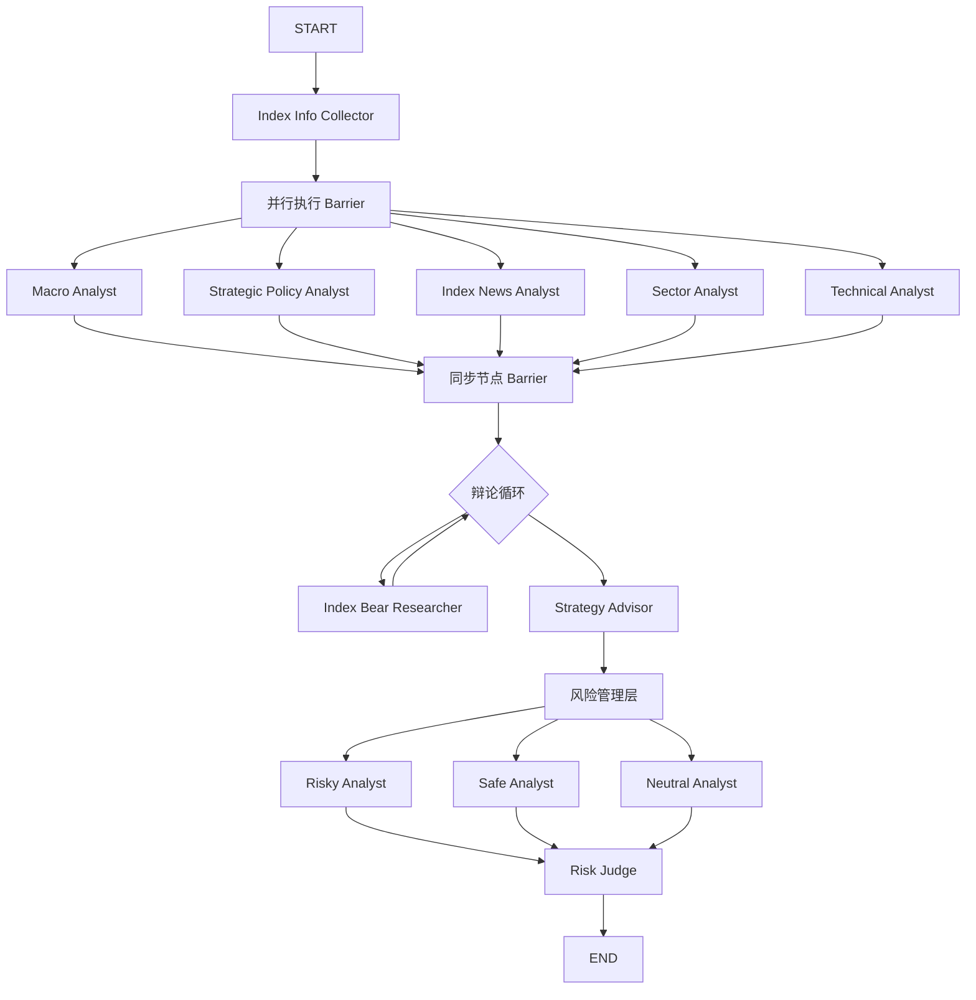

# 指数分析 Workflow 整体介绍

## 1. 概述

TradingAgents-CN 的指数分析模块采用基于 LangGraph 的并行执行架构。该 Workflow 旨在通过多个专业分析师 Agent 的协同工作，从宏观经济、政策导向、行业板块、国际新闻及技术面等多个维度对目标指数进行深度剖析，最终由策略顾问（Strategy Advisor）基于多空博弈和风险评估，生成结构化的投资建议。

与个股分析相比，指数分析 Workflow 的特点在于：
*   **并行化架构**: 多个上游 Agent 同时执行，显著提升分析效率。
*   **固定的专家组合**: 强制使用 Macro、Policy、International News、Sector、Technical 五大核心分析师，确保分析的全面性和专业性。
*   **结构化决策**: 引入 Index Bull/Bear Researcher 进行多空辩论，并通过 Strategy Advisor 进行最终决策。
*   **参数化控制**: 支持 `research_depth` 参数，动态调整辩论轮次、风险讨论深度及记忆检索机制。

## 2. 核心架构图

## 3. 详细流程说明

### 3.1 准备阶段 (Initialization)
*   **入口**: `Index Info Collector`
*   **功能**:
    *   接收用户输入的指数代码（支持中文名称、数字代码）。
    *   通过 `IndexResolver` 智能解析指数类型（概念板块/行业板块/标准指数）。
    *   获取指数的基础信息（成分股、描述、市场归属）并存入全局 `AgentState`。

### 3.2 并行分析阶段 (Parallel Analysis)
系统同时启动 5 个独立的分析师 Agent，它们之间互不依赖，并行获取数据并生成报告：

1.  **Macro Analyst (宏观分析)**: 分析 GDP、CPI、PMI、货币供应量等宏观指标，判断经济周期。
2.  **Strategic Policy Analyst (战略政策分析)**: (v2.5优化) 专注于已颁布的、正式的、具有长期指导意义的国内政策文件（如五年规划、政府工作报告）的深度解读，评估政策的长期影响和结构性变化，**不处理短期传闻**。
3.  **Index News Analyst (综合新闻)**: (v2.5优化) 统筹分析所有短期、即时性强的国内外新闻消息。包括国际新闻（彭博/路透）、国内政策传闻、市场热点和突发事件，评估其短期冲击和市场情绪影响。
4.  **Sector Analyst (板块轮动)**: 分析当前市场的主线板块、资金流向及板块间的轮动效应。
5.  **Technical Analyst (技术分析)**: (v2.2新增) 基于 K 线、均线、MACD/RSI 等指标，提供量化的趋势判断和支撑/阻力位分析。

每个 Agent 都具备明确的结构化输出要求（通常为 JSON），拥有独立的重试机制和降级策略，确保单点故障不影响整体流程，并确保在数据获取受限或分析失败时也能提供结构化、可处理的降级报告。

### 3.3 同步与状态合并 (Synchronization)
*   所有并行 Agent 完成任务后，进入 Barrier 同步节点。
*   将各 Agent 生成的 JSON+Markdown 混合格式报告（包含置信度评分）汇总到 `AgentState` 中。

### 3.4 多空博弈阶段 (Debate & Research)
*   **Index Bull Researcher (多头研究员)**: 基于汇总的分析报告，挖掘市场上涨的逻辑和机会，检索历史类似上涨行情的记忆。
*   **Index Bear Researcher (空头研究员)**: 针对多头观点进行反驳，挖掘潜在风险和下行压力，检索历史风险案例。
*   **循环辩论**: 根据 `research_depth` 参数配置，双方可进行多轮（1-3轮）辩论，确保观点的充分碰撞。

### 3.5 决策阶段 (Strategic Decision)
*   **Strategy Advisor (策略顾问)**:
    *   作为最终决策者，综合上游所有分析报告及多空辩论结果。
    *   结合历史策略记忆（Memory Reflection），生成最终的投资策略报告。
    *   输出包括：仓位建议（0-100%）、操作方向（买入/卖出/观望）、风险提示及核心逻辑摘要。

### 3.6 风险管理阶段 (Risk Management Layer)
在策略顾问生成初步决策后，系统进入风险管理层进行二次评估，通过激进、保守、中性三个维度的辩论，确保决策的稳健性。

*   **Risky Analyst (激进分析师)**: 挑战策略顾问的保守倾向，挖掘潜在的高收益机会，强调上行空间。
*   **Safe Analyst (保守分析师)**: 质疑策略顾问的激进倾向，强调潜在风险和黑天鹅事件，关注下行保护。
*   **Neutral Analyst (中性分析师)**: 平衡激进和保守观点，提供客观的第三方视角，弥合分歧。
*   **Risk Judge (风险法官)**: 综合三方辩论结果，对 Strategy Advisor 的初步决策进行最终裁决，确认是否需要调整仓位或增加风险提示。

## 4. 可观测性与日志体系

系统内置统一的日志管理器 (`TradingAgentsLogger`)，为 Workflow 提供全链路的可观测性支持：

*   **多级别、多格式日志**：支持彩色控制台输出、文件日志轮转、独立错误日志，以及面向机器分析的结构化 JSON 日志。
*   **灵活配置**：日志级别、输出目标、文件轮转策略均可通过配置文件 (`logging.toml`) 或环境变量灵活调整。
*   **业务事件追踪**：针对分析任务的启动、完成、模块执行、LLM token 使用等关键业务事件进行结构化记录，为系统监控、成本统计和性能优化提供深入洞察。

## 5. 关键参数说明

### `research_depth` (研究深度)
控制分析的精细度和资源消耗：

| 等级 | 描述 | 辩论轮次 | 风险讨论 | 记忆检索 | 适用模型(示例) |
| :--- | :--- | :--- | :--- | :--- | :--- |
| **1级** | 快速分析 | 1轮 | 1轮 | 关闭 | qwen-turbo / gemini-flash |
| **3级** | 标准分析 | 1轮 | 2轮 | 开启 | qwen-plus / gemini-pro |
| **5级** | 全面分析 | 3轮 | 3轮 | 开启 | qwen-max / gemini-ultra |

*注：模型选择策略会根据配置的 LLM Provider 动态调整。*

## 6. 技术亮点

*   **动态图执行**: 利用 LangGraph 的条件边（Conditional Edge）实现循环辩论和动态路由。
*   **状态隔离与共享**: 通过 `AgentState` 在不同 Agent 间传递信息，同时支持并行执行时的状态隔离。
*   **记忆增强 (RAG)**: 利用 Vector DB (Chroma) 存储和检索历史行情与决策，实现"以史为鉴"。
*   **结构化输出**: 强制 Agent 输出 JSON 格式的关键指标（如置信度、趋势信号），便于后续算法处理。