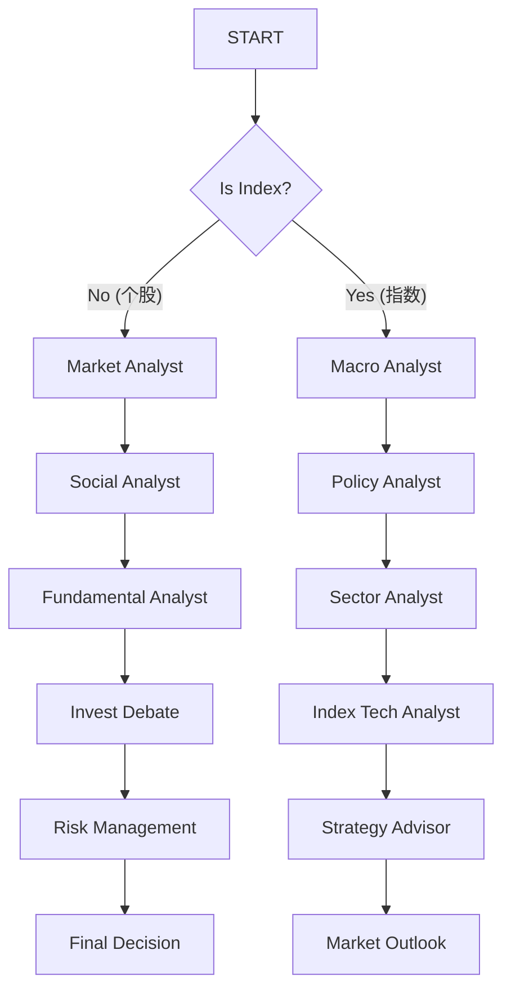

# TradingAgents-CN 指数分析设计方案
## 1. 引言
本设计方案旨在扩展 TradingAgents-CN 的核心能力，使其不仅能够进行个股分析，还能支持**市场指数分析**和**宏观经济分析**。通过引入宏观视角和行业轮动逻辑，系统将能够为用户提供更全面的市场趋势研判，从而辅助自上而下的投资决策。
## 2. 总体架构设计
### 2.1 从线性工作流向分支工作流转变
当前的系统架构主要针对个股分析，采用了线性的工作流（数据收集 -> 多空辩论 -> 风险评估 -> 交易决策）。为了支持指数分析，我们将引入**分支工作流**。
在图（Graph）的 `START` 节点之后，系统将根据输入请求的类型进行路由判断，分别进入“个股分析流程”或“指数分析流程”。
### 2.2 Graph 路由逻辑
*   **路由节点**: 在 `GraphSetup` 中引入一个新的条件边（Conditional Edge）或路由节点。
*   **判断依据**: `AgentState` 中新增 `is_index` 字段。
    *   该字段由入口处（API 或 CLI）根据用户请求参数确定。
    *   或者根据输入的 `ticker` 代码模式自动识别（例如 `000001.SH` 上证指数 vs `600519.SH` 茅台）。
*   **流程分支**:
    1.  **个股分析流程 (Existing)**: 保持现有的 Research Team -> Risk Team -> Trader 流程不变。
    2.  **指数分析流程 (New)**: 进入新设计的宏观与指数分析 Agent 组。
**Mermaid 流程示意**:

## 3. 稳定性优化设计
### 3.1 必要性分析
由于大语言模型（LLM）本质上是概率模型，其输出存在固有的随机性和不稳定性。在金融分析场景下，单一的推理结果可能受随机种子或 Prompt 微小变化的影响而产生偏差。为了提升系统的鲁棒性，我们需要从“单点决策”转向“概率/期望决策”。
用户建议 Agent 输出概率/期望而非单一结论，且策略顾问应进行多次调用以综合判断。采纳此建议能够有效解决 LLM 输出的随机性问题，提高分析结果的可信度和稳定性。
### 3.2 优化策略
1.  **结构化置信度输出**:
    *   所有 Analyst（宏观、政策、行业等）的输出结构中必须增加量化指标。
    *   **confidence (置信度)**: 0-100，表示 Analyst 对自己分析结论的确定程度。
    *   **sentiment_score (情绪分数)**: -1.0 (极度看空) 到 1.0 (极度看多)，量化市场观点。
2.  **多重采样与投票机制 (Ensemble/Voting)**:
    *   策略顾问（Strategy Advisor）在形成最终决策时，不应仅依赖单次推理。
    *   **Ensemble**: 对关键分析步骤进行 N 次（例如 3 次）独立推理。
    *   **Voting**: 综合各 Analyst 的多次输出，通过投票或取平均值来形成最终决策，剔除异常值。
3.  **加权决策机制**:
    *   最终决策应采用加权逻辑，而非简单的算术平均。
    *   权重应基于各 Analyst 提供的 `confidence`。高置信度的观点将在最终决策中占据更大权重。
## 4. 核心组件设计
### 4.1 新增 Agent 角色
针对指数分析流程，需要定义以下新的 Agent 角色。**所有 Analyst 的输出均需包含 `confidence` 和 `sentiment_score`。**
1.  **宏观分析师 (Macro Analyst)**
    *   **职责**: 负责收集和分析宏观经济数据，判断经济周期所处阶段。
    *   **关注指标**: GDP, CPI/PPI, PMI (制造业/服务业), 社融数据, M1/M2 增速, 利率水平 (Shibor, DR007), 汇率。
    *   **输出扩展**: 需包含 `confidence` 和 `sentiment_score`。
2.  **政策分析师 (Policy Analyst)**
    *   **职责**: 搜集并解读政府政策、央行货币政策报告、财政政策动向。
    *   **关注内容**: 重要会议通稿（如政治局会议）、央行公开市场操作、行业监管政策。
    *   **输出扩展**: 需包含 `confidence` 和 `sentiment_score`。
3.  **行业轮动分析师 (Sector Rotation Analyst)**
    *   **职责**: 分析各一级行业的表现，识别强势板块和资金流向。
    *   **关注指标**: 行业指数涨跌幅、板块资金净流入/流出、行业估值水平。
    *   **输出扩展**: 需包含 `confidence` 和 `sentiment_score`。
4.  **指数技术分析师 (Index Technical Analyst)**
    *   **职责**: 专注于大盘指数的技术面分析。
    *   **关注指标**: 指数K线形态、成交量趋势、均线系统、MACD/RSI 等技术指标，关键支撑位/阻力位。
    *   **输出扩展**: 需包含 `confidence` 和 `sentiment_score`。
5.  **策略顾问 (Strategy Advisor)**
    *   **职责**: 汇总上述所有分析师的报告，形成最终的市场观点和资产配置建议。
    *   **决策机制**: 引入**多重采样与投票机制 (Ensemble/Voting)**，进行 N 次独立推理或综合分析。
    *   **加权逻辑**: 基于各 Analyst 的 `confidence` 进行加权，生成最终决策。
    *   **输出**: 市场展望（看多/看空/震荡）、仓位建议、风格偏好（大盘/小盘，价值/成长）。
### 4.2 State 管理 (AgentState 更新)
需要在 `tradingagents/agents/utils/agent_states.py` 的 `AgentState` 类中新增字段以存储指数分析过程中的中间数据。建议存储结构化的 JSON 字符串以包含分数。
```python
class AgentState(MessagesState):
    # ... 现有字段 ...
    # 路由标识
    is_index: bool  # 是否为指数/宏观分析请求
    # 指数/宏观分析流程数据 (建议包含 content, confidence, sentiment_score)
    macro_data: Annotated[str, "宏观经济数据汇总"]
    macro_report: Annotated[str, "宏观分析师报告 (含置信度)"]
    policy_brief: Annotated[str, "政策简报数据"]
    policy_report: Annotated[str, "政策分析师报告 (含置信度)"]
    sector_data: Annotated[str, "行业板块数据"]
    sector_report: Annotated[str, "行业轮动分析报告 (含置信度)"]
    index_tech_data: Annotated[str, "指数技术指标数据"]
    index_tech_report: Annotated[str, "指数技术分析报告 (含置信度)"]
    strategy_outlook: Annotated[str, "策略顾问最终产出的市场展望"]
```
## 5. 数据层设计
### 5.1 新增数据接口
需要扩展 `tradingagents/dataflows` 层，增加获取宏观和指数数据的能力。
*   **Macro Data Interface**:
    *   `get_macro_indices()`: 获取最新的 GDP, CPI, PPI, PMI 数据。
    *   `get_liquidity_metrics()`: 获取 Shibor, 国债收益率等流动性指标。
*   **Sector Data Interface**:
    *   `get_sector_performance(period='daily')`: 获取申万一级/二级行业指数的涨跌幅。
    *   `get_sector_fund_flow()`: 获取板块资金流向。
*   **Index Data Interface**:

    *   复用现有的 `get_stock_data` 但需适配指数代码（如 `sh000001`）。
### 5.2 数据源策略
*   **首选数据源**: **AKShare**。AKShare 在宏观数据（来自国家统计局、东方财富等）和行业数据方面非常丰富且免费。
*   **备选数据源**: **Tushare Pro**。作为补充，用于校验数据的准确性或在 AKShare 不可用时使用。
*   **实现方式**:
    *   在 `OptimizedChinaDataProvider` 中扩展方法，或新建 `MacroDataProvider` 类专门处理宏观数据。
    *   继续沿用缓存机制（MongoDB/File Cache），因为宏观数据（如月度CPI）更新频率低，非常适合缓存。
## 6. 实施步骤
建议按照以下顺序进行开发：
1.  **Phase 1: 数据层基础设施建设**
    *   实现 AKShare 的宏观数据获取函数（GDP, CPI, PMI）。
    *   实现行业指数和资金流向获取函数。
    *   单元测试验证数据获取的稳定性和格式。
2.  **Phase 2: Agent 逻辑与 Prompt 开发 (稳定性升级)**
    *   编写 Macro Analyst, Policy Analyst 等新角色的 System Prompts。
    *   **关键点**: 在 Prompt 中强制要求输出 JSON 格式，包含 `confidence` 和 `sentiment_score`。
    *   创建对应的 LangChain/LangGraph 节点函数。
3.  **Phase 3: 状态管理与图构建**
    *   修改 `AgentState` 添加新字段。
    *   修改 `TradingAgentsGraph`，在 `setup_graph` 中添加分支逻辑和新节点。
    *   实现 `Router` 逻辑。
4.  **Phase 4: 策略整合与输出 (加权与投票)**
    *   实现 Strategy Advisor 的汇总逻辑，**增加 Ensemble/Voting 处理**。
    *   实现基于 confidence 的**加权算法**。
    *   设计最终输出报告的 Markdown 模板。
5.  **Phase 5: 测试与联调**
    *   使用上证指数（000001.SH）进行全流程测试。
    *   验证“个股模式”未受影响（回归测试）。