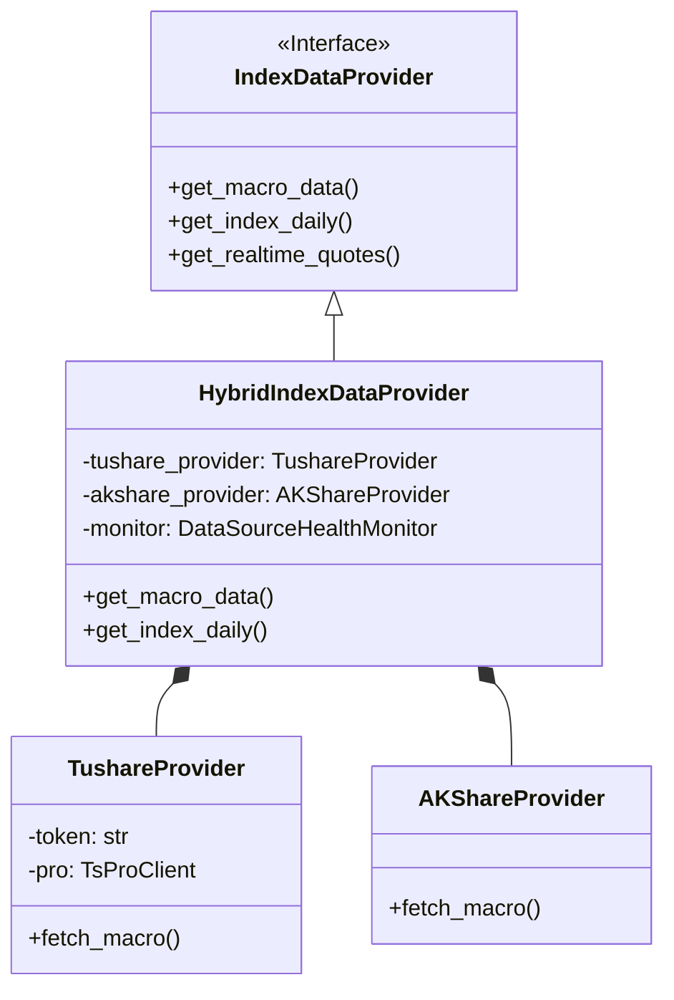

<!--
 * @Author: zhengweicheng 46236959+zwczwczwc@users.noreply.github.com
 * @Date: 2025-12-20 01:54:44
 * @LastEditors: zhengweicheng 46236959+zwczwczwc@users.noreply.github.com
 * @LastEditTime: 2025-12-20 01:58:55
 * @FilePath: /TradingAgents-CN-Test/文档/P0需求一：指数分析workflow/阶段三：数据源优化与决策增强/开发计划/01-混合数据源详细设计.md
 * @Description: 这是默认设置,请设置`customMade`, 打开koroFileHeader查看配置 进行设置: https://github.com/OBKoro1/koro1FileHeader/wiki/%E9%85%8D%E7%BD%AE
-->
# 01-混合数据源详细设计 (Hybrid Data Source)

## 1. 设计目标
构建一个高可用、多源互备的数据底座，解决单一数据源（AKShare）的不稳定性，并引入高质量的 Tushare Pro 数据以支持更精细的决策。

## 2. 架构设计

### 2.1 类图 (Class Diagram)



### 2.2 核心接口定义

#### `HybridIndexDataProvider`
对外暴露的统一入口，屏蔽底层数据源差异。

```python
class HybridIndexDataProvider(IndexDataProvider):
    def __init__(self, config: dict):
        self.config = config
        self.primary_source = "tushare"  # 默认主源
        
    def get_macro_data(self, end_date: str) -> dict:
        """
        获取宏观数据（GDP, CPI, M2等）
        策略：
        1. 检查 Tushare 是否可用且配置了Token
        2. 尝试 Tushare
        3. 失败则降级到 AKShare
        """
        pass
```

## 3. 数据源实现细节

### 3.1 Tushare Pro (Primary)
- **依赖库**: `tushare`
- **配置**: `config.yaml` 中需新增:
  ```yaml
  data_sources:
    tushare:
      token: "YOUR_TOKEN"
      timeout: 5000
  ```
- **核心接口映射**:
  - 宏观数据: `pro.cn_gdp()`, `pro.cn_cpi()`, `pro.cn_m2()`
  - 指数日线: `pro.index_daily(ts_code='000001.SH')`

### 3.2 AKShare (Secondary)
- **依赖库**: `akshare`
- **核心接口映射**:
  - 宏观数据: `ak.macro_china_gdp()`, `ak.macro_china_cpi()`
  - 资金流: `ak.stock_sector_fund_flow_rank()` (东财接口)

### 3.3 异常处理与降级
- **Circuit Breaker**: 当某数据源连续失败 3 次，将其标记为 `UNHEALTHY`，在接下来的 5 分钟内直接跳过该源。
- **Logging**: 所有的降级操作必须记录 WARNING 日志，以便排查 Token 过期等问题。

## 4. 缓存策略调整
- **宏观数据**: 保持 Permanent (永久) 或 Long TTL (7天)，因为宏观数据修正频率低。
- **日线数据**: TTL 24小时，每日收盘后更新。
