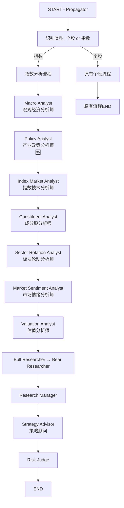

# 指数分析功能设计方案

> **项目**: TradingAgents-CN  
> **日期**: 2025-12-12  
> **版本**: v1.1 (已优化)  
> **作者**: AI Analysis Team

---

## 📢 重要更新说明

### v1.1 优化内容 (2025-12-12)

**针对用户反馈**："指数板块更依赖货币财政与政策支持的影响，例如半导体板块在降息周期 + 自主可控政策下的成长性分析"

**优化措施**：

✅ **新增 Policy Analyst (产业政策分析师) 节点**

**核心功能**:
- 专门分析产业政策对板块的影响（如"自主可控"、"新质生产力"、"双碳目标"等国家战略）
- 建立政策与受益板块的映射关系
- 追踪政府工作报告、五年规划、部委文件
- 评估政策持续性（短期催化 vs 长期趋势）

**解决的问题**:
- ✅ 原方案中 Macro Analyst 只覆盖货币/财政政策，**产业政策分析不够深入**
- ✅ Sector Rotation Analyst 只分析"结果"（板块涨跌），**缺少对"原因"（政策驱动）的解释**
- ✅ 无法系统性回答"为什么这个板块会长期受益"（政策逻辑）

**节点位置**:
```
Macro Analyst (宏观经济) → Policy Analyst (产业政策) 🆕 → Index Market Analyst → ...
```

**数据来源**:
- 政府RSS订阅（中国政府网、发改委、工信部、科技部）
- AKShare 产业政策数据库
- 财经媒体政策解读

**示例输出**（针对您的半导体板块例子）:
```markdown
### 半导体板块政策环境分析

#### 国家战略层面
- "自主可控"战略：国家集成电路产业发展推进纲要
- "科技自立自强"：二十大报告重点强调

#### 产业扶持政策
- 大基金三期：3440亿 + 地方配套
- 税收优惠：集成电路企业所得税减免

#### 货币环境配合
- 中美降息周期：降低企业融资成本

#### 国际环境
- 美国芯片法案：倒逼国产替代加速

**结论**: 政策支持力度极强，建议长期看好。
```

---

## 📋 目录

1. [需求背景](#1-需求背景)
2. [指数分析 vs 个股分析：核心差异](#2-指数分析-vs-个股分析核心差异)
3. [LangGraph 工作流优化设计](#3-langgraph-工作流优化设计)
4. [指数数据获取方案](#4-指数数据获取方案)
5. [技术架构设计](#5-技术架构设计)
6. [API 接口设计](#6-api-接口设计)
7. [实施路线图](#7-实施路线图)
8. [风险与挑战](#8-风险与挑战)
9. [参考资料与数据出处](#9-参考资料与数据出处)

---

## 1. 需求背景

### 1.1 当前状态

当前 TradingAgents-CN 项目仅支持个股分析，分析流程包括：
- 市场分析师：技术指标分析（K线、均线、MACD、RSI等）
- 基本面分析师：财务数据、估值指标、盈利能力
- 新闻分析师：公司相关新闻事件
- 社交媒体分析师：投资者情绪
- 研究团队：多空辩论
- 交易员：具体交易策略
- 风险管理团队：风险评估与最终决策

### 1.2 新需求

支持主流指数分析，包括但不限于：
- **A股指数**: 上证指数(000001.SH)、深证成指(399001.SZ)、沪深300(000300.SH)、中证500(000905.SH)、创业板指(399006.SZ)、科创50(000688.SH)
- **美股指数**: 标普500(^GSPC)、纳斯达克综合指数(^IXIC)、道琼斯工业平均指数(^DJI)
- **港股指数**: 恒生指数(^HSI)、恒生科技指数(HSTECH.HI)
- **板块指数**: 行业板块指数（金融、消费、科技、医药等）、主题指数（新能源、半导体等）

---

## 2. 指数分析 vs 个股分析：核心差异

### 2.1 分析维度对比

| 分析维度 | 个股分析 | 指数分析 |
|---------|---------|---------|
| **基本面** | 公司财务报表、业绩、管理层 | 成分股整体表现、行业景气度、宏观经济 |
| **技术面** | 个股K线、成交量、技术指标 | 指数K线、市场宽度、资金流向、板块轮动 |
| **新闻面** | 公司特定新闻、公告 | 宏观政策、行业动态、系统性风险事件 |
| **情绪面** | 个股舆情、投资者情绪 | 市场整体情绪、风险偏好、恐慌指数 |
| **估值** | P/E、P/B、DCF估值 | 整体估值水平、历史分位数、国际对比 |

### 2.2 指数分析的独特关注点

基于联网搜索结果和行业最佳实践，指数分析需要着重关注：

1. **宏观经济周期** *(参考: BigQuant-宏观趋势下的行业轮动策略)*
   - GDP增速、PMI、CPI/PPI
   - 利率政策、货币供应量
   - 国际贸易、汇率波动

2. **成分股分析** *(参考: Tushare-指数成分和权重API)*
   - 成分股权重分布
   - 权重股表现对指数的影响
   - 成分股调整预期

3. **板块轮动** *(参考: 中泰时钟风格轮动模型)*
   - 周期板块（上游、中游、下游）
   - 成长板块（科技、新能源）
   - 防御板块（消费、医药、公用事业）
   - 金融板块（银行、保险、证券）

4. **市场风格** *(参考: 中信市场风格指数、申万风格指数)*
   - 大盘 vs 小盘
   - 价值 vs 成长
   - 周期 vs 防御

5. **资金流向**
   - 北向资金/南向资金流入流出
   - 融资融券余额变化
   - ETF申购赎回情况

6. **估值分位数**
   - 当前估值在历史中的分位数
   - 与国际同类指数的估值对比
   - 隐含风险溢价

### 2.3 需要弱化的分析内容

相比个股，指数分析中以下内容可以简化或弱化：
- ❌ 个别公司的财务报表细节
- ❌ 单一公司的新闻公告
- ❌ 特定公司的管理层评价
- ⚠️ 社交媒体情绪（转为整体市场情绪）

---

## 3. LangGraph 工作流优化设计

### 3.1 当前个股分析流程

```
START → Propagator
  ↓
Market Analyst (技术分析) → Tools → Message Clear
  ↓
News Analyst (新闻分析) → Tools → Message Clear
  ↓
Social Analyst (社交媒体) → Tools → Message Clear
  ↓
Fundamentals Analyst (基本面) → Tools → Message Clear
  ↓
Bull Researcher ↔ Bear Researcher (多轮辩论)
  ↓
Research Manager (研究结论)
  ↓
Trader (交易策略)
  ↓
Risk Analysts (Risky/Safe/Neutral) 多轮辩论
  ↓
Risk Judge (最终决策)
  ↓
SignalProcessor → END
```

### 3.2 指数分析优化流程



### 3.3 新增节点说明

#### 3.3.1 Macro Analyst (宏观经济分析师) - **新增**

**作用**: 分析宏观经济环境对指数的影响

**数据来源**:
- GDP、PMI、CPI/PPI 数据 (AKShare/Tushare)
- 央行政策利率、货币供应量 (Wind/AKShare)
- 国际贸易数据、汇率 (AKShare)

**工具**:
```python
@tool
def get_macro_economic_data(
    curr_date: str,
    indicators: List[str] = ["GDP", "PMI", "CPI", "M2"]
) -> str:
    """获取宏观经济指标数据"""
```

**输出**:
- `macro_report`: 包含经济周期判断、货币/财政政策分析、国际环境评估

**对最终决策的贡献**:
- 判断是否处于经济上行/下行周期
- 评估货币政策（利率、降息/加息周期）对市场的影响
- 评估财政政策（减税、专项债）对经济的拉动
- 识别系统性风险（经济衰退、政策转向）

---

#### 3.3.2 Policy Analyst (产业政策分析师) - **🆕 新增**

**作用**: 分析产业政策对板块和指数的影响（**针对您提出的问题新增**）

**核心功能**:
1. **国家战略解读**：分析国家级产业政策（如"中国制造2025"、"自主可控"、"新质生产力"、"双碳目标"）
2. **政策-板块映射**：建立政策与受益板块的关联关系
3. **政策时效性追踪**：解析政府工作报告、五年规划、部委文件
4. **政策催化剂识别**：识别短期政策催化（如补贴、税收优惠）和长期趋势

**数据来源**:
- 政府公开文件（RSS订阅）：
  - 中国政府网 (http://www.gov.cn)
  - 发改委、工信部、科技部官网
  - 央行、财政部公告
- 政策数据库（AKShare）：
  - 产业政策摘要
  - 行业扶持政策
- 新闻爬虫/RSS：财经媒体的政策解读

**工具**:
```python
@tool
def get_policy_analysis(
    curr_date: str,
    focus_sectors: List[str] = None,  # 可选：关注的板块，如 ["半导体", "新能源"]
    period: int = 90  # 分析最近N天的政策
) -> str:
    """
    获取产业政策分析
    
    返回内容:
    1. 近期重大产业政策汇总
    2. 政策对各板块的影响评估
    3. 政策受益/受损板块排名
    4. 政策持续性和执行力度判断
    """
```

**具体分析维度**:

1. **半导体板块示例分析**（您提到的例子）：
   ```markdown
   ### 半导体板块政策环境分析
   
   #### 1. 国家战略层面
   - 「自主可控」战略：《国家集成电路产业发展推进纲要》
   - 「科技自立自强」：二十大报告重点强调
   - 「新质生产力」：半导体作为核心要素
   
   #### 2. 产业扶持政策
   - 大基金三期：预计投资规模3000亿+
   - 税收优惠：集成电路企业所得税减免
   - 研发补贴：各地方政府专项资金
   
   #### 3. 国际环境
   - 美国芯片法案：倒逼国产替代加速
   - 中美科技博弈：长期利好自主可控
   
   #### 4. 货币环境配合
   - 中美降息周期：降低企业融资成本
   - 科创板注册制：拓宽融资渠道
   
   #### 5. 政策持续性评估
   - 短期催化：✅ 强（政策密集出台期）
   - 中期支持：✅ 强（"十四五"规划重点）
   - 长期趋势：✅ 强（国家安全战略级）
   
   **结论**: 半导体板块政策支持力度极强，建议长期看好。
   ```

2. **其他板块示例**：
   - 新能源："双碳"目标、可再生能源补贴
   - 人工智能："新一代人工智能发展规划"
   - 生物医药："健康中国2030"、创新药审批加速
   - 军工：国防现代化、国产化率提升

**输出**:
- `policy_report`: 包含政策环境分析、受益板块排名、政策风险预警

**对最终决策的贡献**:
- **核心贡献**：解答"为什么这个板块会长期受益"（政策逻辑）
- 识别政策驱动的投资机会（如您提到的半导体）
- 评估政策持续性（短期炒作 vs 长期趋势）
- 预警政策转向风险（如"双减"政策对教培板块）
- 为 Sector Rotation Analyst 提供"板块轮动原因"的深层解释

**与其他节点的协同**:
- **Macro Analyst** 提供货币/财政大环境 → **Policy Analyst** 细化到产业政策
- **Policy Analyst** 识别受益板块 → **Sector Rotation Analyst** 分析板块表现
- **Policy Analyst** 提供政策逻辑 → **Research Manager** 形成投资主线

---

#### 3.3.3 Index Market Analyst (指数技术分析师) - **复用+优化**

**作用**: 分析指数的技术走势

**与原 Market Analyst 的区别**:
- 增加市场宽度指标（上涨家数/下跌家数比）
- 增加资金流向指标（北向资金、ETF资金流）
- 增加波动率指标（VIX类指标）

**数据来源**:
- 指数历史行情 (AKShare/Tushare/YFinance)
- 市场宽度数据 (AKShare)
- 资金流向数据 (AKShare/Tushare)

**工具**: 复用并扩展 `get_stock_market_data_unified`

**输出**:
- `index_market_report`: 技术走势、支撑阻力位、资金流向

---

#### 3.3.4 Constituent Analyst (成分股分析师) - **新增**

**作用**: 分析指数成分股的整体表现和权重影响

**数据来源**:
- 指数成分股列表及权重 (Tushare `index_weight` API)
- 成分股涨跌情况 (AKShare/Tushare)
- 权重股业绩预期 (新闻/研报摘要)

**工具**:
```python
@tool
def get_index_constituents(
    index_code: str,
    trade_date: str
) -> str:
    """获取指数成分股及权重"""
    # 调用 Tushare index_weight API
    # 返回: 成分股代码、名称、权重、涨跌幅
```

**输出**:
- `constituent_report`: 权重股表现、成分股分化情况、调整预期

**对最终决策的贡献**:
- 识别权重股拖累/推动指数
- 预警成分股调整风险
- 评估指数代表性

---

#### 3.3.5 Sector Rotation Analyst (板块轮动分析师) - **新增**

**作用**: 分析板块轮动和行业景气度（结合 Policy Analyst 的政策分析）

**数据来源**:
- 板块指数涨跌 (AKShare/Tushare)
- 行业景气度指标 (行业利润增速、PMI分项)
- 资金流向各板块情况 (北向资金行业分布)
- **政策驱动因素** (来自 Policy Analyst 的 policy_report)

**工具**:
```python
@tool
def get_sector_performance(
    trade_date: str,
    period: int = 30
) -> str:
    """获取板块轮动数据"""
    # 获取主要板块指数近期表现
    # 返回: 板块涨跌幅排名、资金流向、景气度评分
```

**分析逻辑优化**（结合政策）:
```markdown
### 板块轮动分析框架

1. **数据层**: 板块涨跌幅、资金流向（原有）
2. **驱动层**: 政策支持、宏观环境（新增）
3. **验证层**: 基本面景气度、技术面强度

示例：
- 半导体板块近30日涨幅 +15%
- 北向资金净流入 50亿
- **政策驱动**: 自主可控 + 降息周期（来自 Policy Analyst）
- **结论**: 政策驱动型上涨，具备持续性
```

**输出**:
- `sector_rotation_report`: 当前热点板块、轮动趋势、**政策驱动分析**、配置建议

**对最终决策的贡献**:
- 识别市场风格（大盘/小盘、价值/成长）
- 捕捉板块轮动机会
- **区分政策驱动 vs 资金驱动**（新增）
- 预测指数未来走势

---

#### 3.3.6 Market Sentiment Analyst (市场情绪分析师) - **复用+优化**

**作用**: 分析市场整体情绪和风险偏好

**与原 Social Analyst 的区别**:
- 从个股舆情转为市场整体情绪
- 增加恐慌指数、波动率指数
- 增加融资融券情绪指标

**数据来源**:
- 市场情绪指标 (AKShare)
- 融资融券余额 (Tushare)
- 新闻舆情分析 (爬虫/RSS)

**工具**: 复用并优化 `get_stock_sentiment_unified`

**输出**:
- `market_sentiment_report`: 情绪评分、风险偏好、极端情绪预警

---

#### 3.3.7 Valuation Analyst (估值分析师) - **新增**

**作用**: 分析指数估值水平和历史分位数

**数据来源**:
- 指数PE/PB历史数据 (Tushare/AKShare)
- 国际指数估值对比 (YFinance)
- 隐含风险溢价 (计算: E/P - 无风险利率)

**工具**:
```python
@tool
def get_index_valuation(
    index_code: str,
    trade_date: str
) -> str:
    """获取指数估值数据"""
    # 获取当前PE/PB及历史分位数
    # 返回: 当前估值、历史分位数、国际对比
```

**输出**:
- `valuation_report`: 估值水平、历史分位数、估值吸引力

**对最终决策的贡献**:
- 判断指数高估/低估
- 评估长期投资价值
- 预警估值风险

---

#### 3.3.8 Strategy Advisor (策略顾问) - **替代 Trader**

**作用**: 基于指数分析给出配置建议（而非具体交易）

**与原 Trader 的区别**:
- 个股: 买入/卖出具体股票
- 指数: 增配/减配某个板块/指数，或建议通过ETF/期指操作

**输入**:
- 所有分析师报告 + Research Manager 的投资计划

**输出**:
- `strategy_plan`: 配置建议、仓位建议、对冲策略

---

### 3.4 节点复用策略

| 原节点 | 指数分析中的复用方式 | 是否需要修改 |
|-------|-------------------|------------||
| Market Analyst | 复用为 Index Market Analyst | ✅ 需优化工具 |
| News Analyst | **移除**，新闻合并到宏观分析和板块分析 | ❌ 不复用 |
| Social Analyst | 复用为 Market Sentiment Analyst | ✅ 需优化工具 |
| Fundamentals Analyst | **移除**，替换为成分股分析和估值分析 | ❌ 不复用 |
| - | **新增** Macro Analyst | ✅ 新节点 |
| - | **新增** Policy Analyst 🆕 | ✅ 新节点 |
| - | **新增** Constituent Analyst | ✅ 新节点 |
| - | **新增** Sector Rotation Analyst | ✅ 新节点 |
| - | **新增** Valuation Analyst | ✅ 新节点 |
| Bull/Bear Researcher | **完全复用** | ✅ 无需修改 |
| Research Manager | **完全复用** | ✅ 无需修改 |
| Trader | 替换为 Strategy Advisor | ✅ 需修改逻辑 |
| Risk Analysts & Risk Judge | **完全复用** | ✅ 无需修改 |

---

## 4. 指数数据获取方案

### 4.1 数据需求清单

| 数据类型 | A股数据源 | 美股数据源 | 港股数据源 | 优先级 |
|---------|----------|-----------|----------|-------|
| **指数基本信息** | Tushare/AKShare | YFinance | YFinance | 🔥 高 |
| **指数历史行情** | Tushare/AKShare | YFinance | YFinance | 🔥 高 |
| **指数成分股** | Tushare `index_weight` | S&P官网/爬虫 | HSI官网/YFinance | 🔥 高 |
| **宏观经济数据** | AKShare/Wind | FRED API | Census & Statistics | 🔥 高 |
| **产业政策数据** 🆕 | 政府RSS/AKShare | - | - | 🔥 高 |
| **板块指数** | Tushare/AKShare | - | - | ⚠️ 中 |
| **市场宽度数据** | AKShare | YFinance | - | ⚠️ 中 |
| **资金流向** | Tushare/AKShare | - | - | ⚠️ 中 |
| **估值历史** | Tushare | YFinance | YFinance | ⚠️ 中 |

### 4.2 推荐数据源实现

#### 4.2.1 A股指数数据 - **AKShare (主) + Tushare (辅)**

**优势**:
- ✅ 免费开源
- ✅ 数据覆盖全面
- ✅ 项目已集成
- ✅ 社区活跃

**参考**: 
- AKShare 文档: https://akshare.akfamily.xyz/data/index/index.html
- GitHub: https://github.com/akfamily/akshare

**示例代码**:

```python
import akshare as ak

# 1. 获取指数实时行情
def get_china_index_realtime():
    """获取A股主要指数实时行情"""
    df = ak.stock_zh_index_spot_em(symbol="沪深重要指数")
    # 返回: 代码、名称、最新价、涨跌幅、成交量等
    return df

# 2. 获取指数历史行情
def get_china_index_daily(symbol="sh000001", start_date="20240101", end_date="20241212"):
    """获取指数历史K线数据"""
    df = ak.stock_zh_index_daily(symbol=symbol)
    # 返回: 日期、开盘、收盘、最高、最低、成交量
    return df

# 3. 获取指数成分股 (使用Tushare)
import tushare as ts
def get_index_constituents(index_code="000300.SH", trade_date="20241212"):
    """获取指数成分股及权重"""
    pro = ts.pro_api()  # 需要Tushare Token
    df = pro.index_weight(
        index_code=index_code,
        start_date=trade_date,
        end_date=trade_date
    )
    # 返回: 成分股代码、权重
    return df

# 4. 获取宏观经济数据
def get_macro_data():
    """获取宏观经济指标"""
    # GDP
    gdp_df = ak.macro_china_gdp()
    
    # PMI
    pmi_df = ak.macro_china_pmi()
    
    # CPI/PPI
    cpi_df = ak.macro_china_cpi()
    ppi_df = ak.macro_china_ppi()
    
    # M2货币供应
    m2_df = ak.macro_china_money_supply()
    
    return {
        "gdp": gdp_df,
        "pmi": pmi_df,
        "cpi": cpi_df,
        "ppi": ppi_df,
        "m2": m2_df
    }

# 5. 获取板块指数
def get_sector_indices():
    """获取申万行业指数"""
    df = ak.sw_index_spot()  # 申万行业指数实时行情
    return df

# 6. 获取北向资金流向
def get_northbound_flow(trade_date="20241212"):
    """获取北向资金流向"""
    df = ak.stock_hsgt_north_net_flow_in_em(symbol="沪股通")
    return df
```

#### 4.2.2 美股指数数据 - **YFinance**

**参考**: GitHub - https://github.com/ranaroussi/yfinance

**示例代码**:

```python
import yfinance as yf

def get_us_index_data(symbol="^GSPC", start="2024-01-01", end="2024-12-12"):
    """获取美股指数数据"""
    # ^GSPC: 标普500
    # ^IXIC: 纳斯达克
    # ^DJI: 道琼斯
    
    ticker = yf.Ticker(symbol)
    
    # 历史行情
    hist = ticker.history(start=start, end=end)
    
    # 基本信息
    info = ticker.info
    
    return hist, info

def get_sp500_constituents():
    """获取标普500成分股"""
    # 方法1: 通过Wikipedia爬取
    import pandas as pd
    url = "https://en.wikipedia.org/wiki/List_of_S%26P_500_companies"
    tables = pd.read_html(url)
    sp500 = tables[0]
    return sp500
    
    # 方法2: 使用现成的库
    # pip install sp500
    # from sp500 import SP500
    # sp = SP500()
    # constituents = sp.get_constituents()
```

#### 4.2.3 港股指数数据 - **YFinance**

```python
def get_hk_index_data(symbol="^HSI"):
    """获取恒生指数数据"""
    # ^HSI: 恒生指数
    # ^HSTECH: 恒生科技指数
    
    ticker = yf.Ticker(symbol)
    hist = ticker.history(period="1y")
    return hist
```

### 4.3 是否需要爬虫模块？

**结论**: **不需要专门开发爬虫，但可以补充RSS订阅**

**原因**:
1. AKShare/Tushare/YFinance 已覆盖 90% 数据需求
2. 爬虫维护成本高（网站改版、反爬虫）
3. RSS订阅更稳定（针对宏观新闻）

**推荐补充方案**:

```python
# RSS 订阅方案 (用于获取宏观新闻)
import feedparser

def get_macro_news_from_rss():
    """从RSS获取宏观经济新闻"""
    feeds = [
        "http://www.gov.cn/xinwen/rss.xml",  # 中国政府网
        "http://www.pbc.gov.cn/rss/rss.xml",  # 央行
        # 可添加更多RSS源
    ]
    
    news_list = []
    for feed_url in feeds:
        feed = feedparser.parse(feed_url)
        for entry in feed.entries:
            news_list.append({
                "title": entry.title,
                "link": entry.link,
                "published": entry.published,
                "summary": entry.summary
            })
    
    return news_list
```

### 4.4 参考GitHub项目

| 项目名称 | 用途 | 链接 | 是否可直接使用 |
|---------|------|------|--------------|
| **AKShare** | A股/指数数据 | https://github.com/akfamily/akshare | ✅ 已集成 |
| **Tushare** | 高级财经数据 | http://tushare.org | ✅ 已集成 |
| **YFinance** | 美股/港股数据 | https://github.com/ranaroussi/yfinance | ✅ 已集成 |
| **CSI500-Quant-Tool** | 中证500分析工具 | https://github.com/yan333er/CSI500-Quant-Tool | ⚠️ 可参考思路 |
| **StockDataDownloader** | Baostock K线下载 | https://github.com/lzhttn/StockDataDownloader | ⚠️ 可参考 |

---

## 5. 技术架构设计

### 5.1 目录结构

```
tradingagents/
├── agents/
│   ├── analysts/
│   │   ├── market_analyst.py              # 复用并优化
│   │   ├── index_market_analyst.py        # 新增：指数技术分析
│   │   ├── macro_analyst.py               # 新增：宏观经济分析
│   │   ├── constituent_analyst.py         # 新增：成分股分析
│   │   ├── sector_rotation_analyst.py     # 新增：板块轮动分析
│   │   ├── market_sentiment_analyst.py    # 新增：市场情绪分析
│   │   └── valuation_analyst.py           # 新增：估值分析
│   ├── traders/
│   │   └── strategy_advisor.py            # 新增：替代trader.py用于指数
│   └── utils/
│       ├── agent_utils.py                 # 扩展：新增指数工具
│       └── index_utils.py                 # 新增：指数专用工具集
├── dataflows/
│   ├── providers/
│   │   ├── china/
│   │   │   └── index_provider.py          # 新增：A股指数数据提供者
│   │   ├── us/
│   │   │   └── index_provider.py          # 新增：美股指数数据提供者
│   │   └── hk/
│   │       └── index_provider.py          # 新增：港股指数数据提供者
│   └── interface.py                       # 扩展：新增指数数据接口
├── graph/
│   ├── trading_graph.py                   # 修改：支持指数分析
│   ├── setup.py                           # 修改：添加指数分析节点
│   └── index_setup.py                     # 新增：指数专用图构建
├── utils/
│   ├── stock_utils.py                     # 扩展：识别指数代码
│   └── index_validator.py                 # 新增：指数数据校验
└── constants.py                           # 扩展：添加指数常量

app/
├── routers/
│   └── analysis.py                        # 修改：支持指数分析请求
└── models/
    └── analysis.py                        # 扩展：指数分析请求/响应模型
```

### 5.2 核心代码设计

#### 5.2.1 指数识别与类型判断

```python
# tradingagents/utils/stock_utils.py

class StockUtils:
    
    INDEX_PATTERNS = {
        # A股指数
        "sh000001": "上证指数",
        "sh000300": "沪深300",
        "sh000905": "中证500",
        "sh000688": "科创50",
        "sz399001": "深证成指",
        "sz399006": "创业板指",
        
        # 美股指数
        "^GSPC": "标普500",
        "^IXIC": "纳斯达克综合指数",
        "^DJI": "道琼斯工业平均指数",
        
        # 港股指数
        "^HSI": "恒生指数",
        "^HSTECH": "恒生科技指数",
    }
    
    @staticmethod
    def is_index(symbol: str) -> bool:
        """判断是否为指数代码"""
        symbol = symbol.lower()
        
        # A股指数特征
        if symbol.startswith("sh000") or symbol.startswith("sz399"):
            return True
        
        # 美股/港股指数特征
        if symbol.startswith("^"):
            return True
        
        # 显式指数列表
        if symbol in StockUtils.INDEX_PATTERNS:
            return True
        
        return False
    
    @staticmethod
    def get_index_info(symbol: str) -> dict:
        """获取指数信息"""
        if not StockUtils.is_index(symbol):
            return {"is_index": False}
        
        symbol_lower = symbol.lower()
        
        # 判断市场
        if symbol_lower.startswith("sh") or symbol_lower.startswith("sz"):
            market = "CN"
            market_name = "A股指数"
        elif symbol_lower.startswith("^hsi") or symbol_lower.startswith("^hstech"):
            market = "HK"
            market_name = "港股指数"
        elif symbol_lower.startswith("^"):
            market = "US"
            market_name = "美股指数"
        else:
            market = "UNKNOWN"
            market_name = "未知市场"
        
        return {
            "is_index": True,
            "symbol": symbol,
            "name": StockUtils.INDEX_PATTERNS.get(symbol_lower, "未知指数"),
            "market": market,
            "market_name": market_name
        }
```

#### 5.2.2 指数数据接口

```python
# tradingagents/dataflows/interface.py

def get_index_data_unified(
    index_code: str,
    start_date: str,
    end_date: str,
    data_type: str = "daily"
) -> str:
    """
    统一指数数据获取接口
    
    Args:
        index_code: 指数代码
        start_date: 开始日期
        end_date: 结束日期
        data_type: 数据类型 (daily/weekly/monthly)
    
    Returns:
        str: Markdown格式的指数数据
    """
    from tradingagents.utils.stock_utils import StockUtils
    
    index_info = StockUtils.get_index_info(index_code)
    
    if not index_info["is_index"]:
        return f"错误: {index_code} 不是有效的指数代码"
    
    market = index_info["market"]
    
    if market == "CN":
        from tradingagents.dataflows.providers.china.index_provider import ChinaIndexProvider
        provider = ChinaIndexProvider()
        return provider.get_index_data(index_code, start_date, end_date)
    
    elif market == "US":
        from tradingagents.dataflows.providers.us.index_provider import USIndexProvider
        provider = USIndexProvider()
        return provider.get_index_data(index_code, start_date, end_date)
    
    elif market == "HK":
        from tradingagents.dataflows.providers.hk.index_provider import HKIndexProvider
        provider = HKIndexProvider()
        return provider.get_index_data(index_code, start_date, end_date)
    
    else:
        return f"错误: 不支持的市场 {market}"


def get_index_constituents_unified(
    index_code: str,
    trade_date: str
) -> str:
    """
    统一获取指数成分股
    
    Args:
        index_code: 指数代码
        trade_date: 交易日期
    
    Returns:
        str: Markdown格式的成分股数据
    """
    # 实现逻辑类似上面
    pass


def get_macro_data_unified(
    curr_date: str,
    indicators: List[str] = None
) -> str:
    """
    统一获取宏观经济数据
    
    Args:
        curr_date: 当前日期
        indicators: 指标列表 ["GDP", "PMI", "CPI", "M2"]
    
    Returns:
        str: Markdown格式的宏观数据
    """
    # 实现逻辑
    pass


def get_policy_data_unified(
    curr_date: str,
    focus_sectors: List[str] = None,
    period: int = 90
) -> str:
    """
    统一获取产业政策数据 🆕
    
    Args:
        curr_date: 当前日期
        focus_sectors: 关注的板块
        period: 分析最近N天的政策
    
    Returns:
        str: Markdown格式的政策分析数据
    """
    # 实现逻辑
    pass
```

#### 5.2.3 指数分析工具集

```python
# tradingagents/agents/utils/index_utils.py

from langchain.tools import tool
from typing import Annotated, List

class IndexToolkit:
    """指数分析专用工具集"""
    
    @staticmethod
    @tool
    def get_policy_analysis(
        curr_date: Annotated[str, "当前日期，格式 yyyy-mm-dd"],
        focus_sectors: Annotated[List[str], "关注的板块"] = None,
        period: Annotated[int, "分析最近N天的政策"] = 90
    ) -> str:
        """获取产业政策分析"""
        from tradingagents.dataflows.interface import get_policy_data_unified
        return get_policy_data_unified(curr_date, focus_sectors, period)
    
    @staticmethod
    @tool
    def get_index_market_data(
        index_code: Annotated[str, "指数代码，如 sh000300"],
        start_date: Annotated[str, "开始日期，格式 yyyy-mm-dd"],
        end_date: Annotated[str, "结束日期，格式 yyyy-mm-dd"]
    ) -> str:
        """获取指数历史行情数据"""
        from tradingagents.dataflows.interface import get_index_data_unified
        return get_index_data_unified(index_code, start_date, end_date)
    
    @staticmethod
    @tool
    def get_index_constituents(
        index_code: Annotated[str, "指数代码"],
        trade_date: Annotated[str, "交易日期，格式 yyyy-mm-dd"]
    ) -> str:
        """获取指数成分股及权重"""
        from tradingagents.dataflows.interface import get_index_constituents_unified
        return get_index_constituents_unified(index_code, trade_date)
    
    @staticmethod
    @tool
    def get_macro_economic_indicators(
        curr_date: Annotated[str, "当前日期，格式 yyyy-mm-dd"],
        indicators: Annotated[List[str], "宏观指标列表"] = None
    ) -> str:
        """获取宏观经济指标"""
        from tradingagents.dataflows.interface import get_macro_data_unified
        return get_macro_data_unified(curr_date, indicators)
    
    @staticmethod
    @tool
    def get_sector_rotation_data(
        trade_date: Annotated[str, "交易日期"],
        period: Annotated[int, "统计周期(天)"] = 30
    ) -> str:
        """获取板块轮动数据"""
        # 实现逻辑
        pass
    
    @staticmethod
    @tool
    def get_index_valuation(
        index_code: Annotated[str, "指数代码"],
        trade_date: Annotated[str, "交易日期"]
    ) -> str:
        """获取指数估值数据（PE/PB及历史分位数）"""
        # 实现逻辑
        pass
```

#### 5.2.4 图构建逻辑

```python
# tradingagents/graph/setup.py (修改)

def build_trading_graph(
    selected_analysts: List[str],
    analysis_type: str = "stock",  # 新增参数: "stock" or "index"
    debug: bool = False,
    config: dict = None
) -> StateGraph:
    """
    构建交易分析图
    
    Args:
        selected_analysts: 选中的分析师
        analysis_type: 分析类型 ("stock": 个股, "index": 指数)
        debug: 调试模式
        config: 配置
    
    Returns:
        StateGraph: 构建完成的图
    """
    workflow = StateGraph(AgentState)
    
    if analysis_type == "stock":
        # 原有个股分析流程
        return _build_stock_analysis_graph(workflow, selected_analysts, debug, config)
    
    elif analysis_type == "index":
        # 指数分析流程
        return _build_index_analysis_graph(workflow, selected_analysts, debug, config)
    
    else:
        raise ValueError(f"不支持的分析类型: {analysis_type}")


def _build_index_analysis_graph(
    workflow: StateGraph,
    selected_analysts: List[str],
    debug: bool,
    config: dict
) -> StateGraph:
    """构建指数分析图"""
    
    # 1. 宏观经济分析师
    if "macro" in selected_analysts:
        macro_analyst = create_macro_analyst(llm, toolkit)
        workflow.add_node("Macro Analyst", macro_analyst)
        workflow.add_edge(START, "Macro Analyst")
    
    # 2. 产业政策分析师 🆕
    if "policy" in selected_analysts:
        policy_analyst = create_policy_analyst(llm, index_toolkit)
        workflow.add_node("Policy Analyst", policy_analyst)
        # 接在 Macro Analyst 之后
    
    # 3. 指数技术分析师
    index_market_analyst = create_index_market_analyst(llm, index_toolkit)
    workflow.add_node("Index Market Analyst", index_market_analyst)
    
    # 4. 成分股分析师
    constituent_analyst = create_constituent_analyst(llm, index_toolkit)
    workflow.add_node("Constituent Analyst", constituent_analyst)
    
    # 5. 板块轮动分析师
    sector_analyst = create_sector_rotation_analyst(llm, index_toolkit)
    workflow.add_node("Sector Rotation Analyst", sector_analyst)
    
    # 6. 市场情绪分析师
    sentiment_analyst = create_market_sentiment_analyst(llm, toolkit)
    workflow.add_node("Market Sentiment Analyst", sentiment_analyst)
    
    # 7. 估值分析师
    valuation_analyst = create_valuation_analyst(llm, index_toolkit)
    workflow.add_node("Valuation Analyst", valuation_analyst)
    
    # 连接节点（串行）
    workflow.add_edge("Macro Analyst", "Policy Analyst")  # 🆕 新增
    workflow.add_edge("Policy Analyst", "Index Market Analyst")  # 🆕 修改
    workflow.add_edge("Index Market Analyst", "Constituent Analyst")
    workflow.add_edge("Constituent Analyst", "Sector Rotation Analyst")
    workflow.add_edge("Sector Rotation Analyst", "Market Sentiment Analyst")
    workflow.add_edge("Market Sentiment Analyst", "Valuation Analyst")
    
    # 7-9. 研究团队（复用）
    # ... Bull/Bear Researcher, Research Manager
    
    # 10. 策略顾问（替代Trader）
    strategy_advisor = create_strategy_advisor(llm)
    workflow.add_node("Strategy Advisor", strategy_advisor)
    
    # 11. 风险管理（复用）
    # ... Risk Analysts, Risk Judge
    
    workflow.add_edge("Risk Judge", END)
    
    return workflow.compile()
```

---

## 6. API 接口设计

### 6.1 请求模型

```python
# app/models/analysis.py

from pydantic import BaseModel, Field
from typing import Optional, List, Literal

class IndexAnalysisRequest(BaseModel):
    """指数分析请求"""
    
    index_code: str = Field(
        ...,
        description="指数代码",
        example="sh000300"
    )
    
    analysis_date: str = Field(
        ...,
        description="分析日期，格式 YYYY-MM-DD",
        example="2024-12-12"
    )
    
    selected_analysts: List[str] = Field(
        default=["macro", "index_market", "constituent", "sector_rotation", "valuation"],
        description="选中的分析师"
    )
    
    research_depth: int = Field(
        default=3,
        ge=1,
        le=5,
        description="研究深度 (1-5)"
    )
    
    analysis_type: Literal["stock", "index"] = Field(
        default="index",
        description="分析类型"
    )
```

### 6.2 API 端点

```python
# app/routers/analysis.py

@router.post("/api/analysis/index", response_model=TaskResponse)
async def submit_index_analysis(
    request: IndexAnalysisRequest,
    background_tasks: BackgroundTasks,
    db: Session = Depends(get_db)
):
    """
    提交指数分析任务
    
    与个股分析的区别:
    - analysis_type 固定为 "index"
    - 使用指数专用的 LangGraph 流程
    - selected_analysts 为指数分析师列表
    """
    
    # 1. 验证指数代码
    from tradingagents.utils.stock_utils import StockUtils
    index_info = StockUtils.get_index_info(request.index_code)
    
    if not index_info["is_index"]:
        raise HTTPException(
            status_code=400,
            detail=f"{request.index_code} 不是有效的指数代码"
        )
    
    # 2. 创建任务
    task_id = str(uuid.uuid4())
    
    # 3. 后台执行
    background_tasks.add_task(
        execute_index_analysis_background,
        task_id=task_id,
        index_code=request.index_code,
        analysis_date=request.analysis_date,
        config={
            "selected_analysts": request.selected_analysts,
            "research_depth": request.research_depth,
            "analysis_type": "index"
        }
    )
    
    return TaskResponse(
        task_id=task_id,
        status="pending",
        message=f"指数分析任务已提交: {index_info['name']}"
    )
```

### 6.3 统一接口（兼容个股和指数）

```python
@router.post("/api/analysis/unified", response_model=TaskResponse)
async def submit_unified_analysis(
    symbol: str,
    analysis_date: str,
    selected_analysts: Optional[List[str]] = None,
    research_depth: int = 3
):
    """
    统一分析接口（自动识别个股或指数）
    
    示例:
    - symbol="000001" → A股个股分析
    - symbol="sh000300" → 沪深300指数分析
    - symbol="^GSPC" → 标普500指数分析
    """
    
    from tradingagents.utils.stock_utils import StockUtils
    
    # 自动识别
    if StockUtils.is_index(symbol):
        # 指数分析
        request = IndexAnalysisRequest(
            index_code=symbol,
            analysis_date=analysis_date,
            selected_analysts=selected_analysts or ["macro", "index_market", "constituent", "valuation"],
            research_depth=research_depth
        )
        return await submit_index_analysis(request, ...)
    else:
        # 个股分析
        request = SingleAnalysisRequest(
            stock_code=symbol,
            parameters=AnalysisParameters(
                analysis_date=analysis_date,
                selected_analysts=selected_analysts or ["market", "fundamentals", "news", "social"],
                research_depth=research_depth
            )
        )
        return await submit_single_analysis(request, ...)
```

---

## 7. 实施路线图

### Phase 1: 数据层 (1-2周)

**目标**: 建立指数数据获取能力

- [ ] 实现 `ChinaIndexProvider` (AKShare/Tushare)
- [ ] 实现 `USIndexProvider` (YFinance)
- [ ] 实现 `HKIndexProvider` (YFinance)
- [ ] 扩展 `StockUtils.is_index()` 和 `get_index_info()`
- [ ] 实现宏观数据接口 `get_macro_data_unified()`
- [ ] 实现成分股接口 `get_index_constituents_unified()`
- [ ] 单元测试覆盖率 > 80%

**交付物**:
- `tradingagents/dataflows/providers/{china,us,hk}/index_provider.py`
- `tradingagents/dataflows/interface.py` (扩展)
- 测试脚本 `tests/test_index_data.py`

---

### Phase 2: 工具层 (1周)

**目标**: 为LangGraph节点提供工具

- [ ] 实现 `IndexToolkit` 工具集
  - [ ] `get_index_market_data`
  - [ ] `get_index_constituents`
  - [ ] `get_macro_economic_indicators`
  - [ ] `get_sector_rotation_data`
  - [ ] `get_index_valuation`
- [ ] 集成到 `agent_utils.py`

**交付物**:
- `tradingagents/agents/utils/index_utils.py`
- 工具测试脚本

---

### Phase 3: 节点层 (2周)

**目标**: 实现指数分析专用节点

- [ ] `macro_analyst.py` - 宏观经济分析师
- [ ] `index_market_analyst.py` - 指数技术分析师
- [ ] `constituent_analyst.py` - 成分股分析师
- [ ] `sector_rotation_analyst.py` - 板块轮动分析师
- [ ] `market_sentiment_analyst.py` - 市场情绪分析师
- [ ] `valuation_analyst.py` - 估值分析师
- [ ] `strategy_advisor.py` - 策略顾问

**交付物**:
- `tradingagents/agents/analysts/*.py`
- `tradingagents/agents/traders/strategy_advisor.py`

---

### Phase 4: 图构建 (1周)

**目标**: 构建指数分析 LangGraph 工作流

- [ ] 扩展 `build_trading_graph()` 支持 `analysis_type="index"`
- [ ] 实现 `_build_index_analysis_graph()`
- [ ] 节点连接和边逻辑
- [ ] 调试和优化节点顺序

**交付物**:
- `tradingagents/graph/setup.py` (修改)
- `tradingagents/graph/index_setup.py` (新增)

---

### Phase 5: API 层 (1周)

**目标**: 提供后端 API 接口

- [ ] 扩展 `analysis.py` 路由
- [ ] 实现 `submit_index_analysis()`
- [ ] 实现 `submit_unified_analysis()` (自动识别)
- [ ] 响应模型定义
- [ ] API 文档更新

**交付物**:
- `app/routers/analysis.py` (修改)
- `app/models/analysis.py` (扩展)
- Swagger API 文档

---

### Phase 6: 测试与优化 (1-2周)

**目标**: 端到端测试和性能优化

- [ ] 沪深300指数完整分析测试
- [ ] 标普500指数完整分析测试
- [ ] 并发任务测试
- [ ] 性能优化（缓存、并行）
- [ ] 错误处理完善

**交付物**:
- 测试报告
- 性能优化报告
- Bug修复

---

### Phase 7: 文档与发布 (1周)

**目标**: 完善文档并发布功能

- [ ] 更新 README.md
- [ ] 编写用户指南
- [ ] 编写开发者文档
- [ ] 更新 API 文档
- [ ] 发布 Release Notes

**交付物**:
- 用户文档
- 开发者文档
- Release v2.0

---

**总预估时间**: 8-10周

---

## 8. 风险与挑战

### 8.1 数据风险

| 风险 | 影响 | 缓解措施 |
|-----|------|---------|
| Tushare积分不足，无法获取成分股 | 🔴 高 | 使用AKShare备用方案；申请高级账户 |
| AKShare API 限流或不稳定 | 🟡 中 | MongoDB缓存；多数据源降级 |
| YFinance被限流或封禁 | 🟡 中 | 添加请求延迟；使用代理 |
| 宏观数据更新不及时 | 🟢 低 | 显式标注数据时效性 |

### 8.2 技术风险

| 风险 | 影响 | 缓解措施 |
|-----|------|---------|
| LangGraph节点过多导致响应慢 | 🟡 中 | 并行节点；可选节点 |
| LLM Token消耗过大 | 🟡 中 | 优化Prompt；数据摘要 |
| 成分股分析（几百只股票）性能差 | 🟡 中 | 仅分析权重前50名；批量查询 |
| 图构建逻辑复杂度增加 | 🟢 低 | 模块化设计；充分测试 |

### 8.3 业务风险

| 风险 | 影响 | 缓解措施 |
|-----|------|---------|
| 指数分析深度不够，用户不满意 | 🟡 中 | 迭代优化；用户反馈 |
| 宏观分析泛泛而谈，缺乏针对性 | 🟡 中 | 结合指数特点定制分析 |
| 板块轮动判断不准确 | 🟡 中 | 引入量化模型；历史回测 |

---

## 9. 参考资料与数据出处

### 9.1 数据源文档

| 数据源 | 官方文档 | 用途 |
|-------|---------|------|
| **AKShare** | https://akshare.akfamily.xyz | A股指数、宏观数据、板块数据 |
| **Tushare** | http://tushare.org | 指数成分股、高级财经数据 |
| **YFinance** | https://github.com/ranaroussi/yfinance | 美股/港股指数数据 |
| **Baostock** | http://baostock.com | 备用A股数据源 |

### 9.2 学术与行业研究

| 来源 | 标题 | 链接 | 关键贡献 |
|-----|-----|------|---------|
| **BigQuant** | 宏观趋势下的行业轮动策略 | https://bigquant.com/square/paper/92f3ec7f | 宏观指标与行业轮动关系 |
| **BigQuant** | 中泰时钟风格轮动模型 | https://bigquant.com/square/paper/9691ea2a | 五大风格板块划分方法 |
| **新浪财经** | 中信/申万风格指数解读 | https://finance.sina.com.cn/cj/2025-06-15/doc-infaemzf0512884.shtml | 市场风格指数应用 |
| **BigQuant** | 风格指数轮动配置策略 | https://bigquant.com/square/paper/4c56d018 | 成长/价值/大小盘配置 |
| **ResearchGate** | A-Share Industry Rotation | https://www.researchgate.net/publication/375105924 | 价量因子与行业轮动 |

### 9.3 开源项目参考

| 项目 | GitHub | 参考价值 |
|-----|--------|---------|
| **AKShare** | https://github.com/akfamily/akshare | ✅ 数据接口设计 |
| **CSI500-Quant-Tool** | https://github.com/yan333er/CSI500-Quant-Tool | ⚠️ 中证500分析思路 |
| **StockDataDownloader** | https://github.com/lzhttn/StockDataDownloader | ⚠️ Baostock数据下载 |

### 9.4 技术文档

| 主题 | 参考文档 |
|-----|---------|
| LangGraph 工作流 | 项目现有文档 `LANGGRAPH_BACKEND_ANALYSIS.md` |
| MongoDB 数据模型 | `docs/design/stock_data_model_design.md` |
| 多市场架构 | `docs/tech_reviews/2025-11-08-multi-market-implementation-plan.md` |

---

## 10. 附录

### 10.1 主要指数代码映射表

#### A股指数

| 指数名称 | 代码 | 市场 | 用途 |
|---------|-----|------|-----|
| 上证指数 | sh000001 / 000001.SH | 上交所 | 市场整体 |
| 深证成指 | sz399001 / 399001.SZ | 深交所 | 市场整体 |
| 沪深300 | sh000300 / 000300.SH | 跨市场 | 大盘蓝筹 |
| 中证500 | sh000905 / 000905.SH | 跨市场 | 中盘股 |
| 创业板指 | sz399006 / 399006.SZ | 深交所 | 成长股 |
| 科创50 | sh000688 / 000688.SH | 上交所 | 科技创新 |
| 中证1000 | sh000852 / 000852.SH | 跨市场 | 小盘股 |

#### 美股指数

| 指数名称 | 代码 | 用途 |
|---------|-----|-----|
| 标普500 | ^GSPC / SPX | 大盘股 |
| 纳斯达克综合 | ^IXIC / COMP | 科技股 |
| 道琼斯工业 | ^DJI / INDU | 蓝筹股 |
| 纳斯达克100 | ^NDX / NDX | 科技龙头 |
| 罗素2000 | ^RUT / RUT | 小盘股 |

#### 港股指数

| 指数名称 | 代码 | 用途 |
|---------|-----|-----|
| 恒生指数 | ^HSI / HSI | 蓝筹股 |
| 恒生科技 | ^HSTECH / HSTECH | 科技股 |
| 国企指数 | ^HSCE / HSCEI | 国企股 |

### 10.2 分析师节点对比表

| 个股分析节点 | 指数分析节点 | 变化 |
|-----------|-----------|------|
| Market Analyst | Index Market Analyst | ✅ 优化工具 |
| News Analyst | ❌ 移除 | 合并到宏观/板块 |
| Social Analyst | Market Sentiment Analyst | ✅ 优化逻辑 |
| Fundamentals Analyst | ❌ 移除 | 替换为成分股/估值 |
| - | Macro Analyst | ✅ 新增 |
| - | **Policy Analyst 🆕** | ✅ **新增（针对您的需求）** |
| - | Constituent Analyst | ✅ 新增 |
| - | Sector Rotation Analyst | ✅ 新增 |
| - | Valuation Analyst | ✅ 新增 |
| Bull/Bear Researcher | Bull/Bear Researcher | ✅ 完全复用 |
| Research Manager | Research Manager | ✅ 完全复用 |
| Trader | Strategy Advisor | ✅ 修改逻辑 |
| Risk Analysts | Risk Analysts | ✅ 完全复用 |
| Risk Judge | Risk Judge | ✅ 完全复用 |

---

## 结语

本方案基于对现有TradingAgents-CN项目的深入分析，结合指数分析的特点和行业最佳实践，设计了一套完整的指数分析功能。

**核心亮点**:
1. ✅ 复用现有LangGraph架构，降低开发成本
2. ✅ 针对指数特点优化分析流程（宏观、成分股、板块轮动、估值）
3. ✅ 利用已集成的AKShare/Tushare/YFinance，无需额外爬虫
4. ✅ 模块化设计，便于后续扩展
5. ✅ 统一API接口，支持个股和指数自动识别

**预期效果**:
- 用户可通过相同的分析界面，输入指数代码（如 `sh000300`）即可获得专业的指数分析报告
- 报告包含宏观环境、技术走势、成分股表现、板块轮动、估值水平等多维度分析
- 为指数投资、ETF配置、板块轮动策略提供决策支持

---

**文档版本**: v1.0  
**最后更新**: 2025-12-12  
**作者**: AI Analysis Team  
**项目**: TradingAgents-CN
